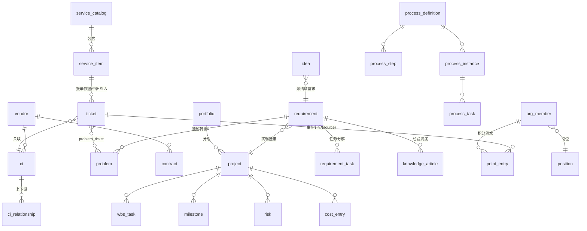

# New_AOM 数据模型设计

> 依据 [03-PRD.md](03-PRD.md)（v1.0 定稿）。共 **49 张表**：支撑 15（含角色/用户组 3 表 + 部门/业务域/开通规则 3 表，M2.5/M3.5 增补）、ITSM 12、项目 6、需求 2、流程 4、团队 10。
> 对照 SN-AOM 106 表；无任何预计算/快照表。

## 0. 全局约定

- 主键：`id CHAR(26)` GLID，系统生成；下文不再逐表列出。
- 所有表含 `created_at` / `updated_at`（服务层自动维护）；业务单据表含 `is_deleted BOOLEAN DEFAULT FALSE` 软删除标记；下文不再逐表列出。
- 人员引用：统一存 `org_member.id`（外键），页面显示姓名。
- 业务编号（`*_code`）：`前缀-YYYYMM-序号`，创建时生成，唯一索引。
- 标注 **[计]** 的字段为系统计算/打点维护，无录入接口；标注 **[配]** 的表仅 admin 维护。

---

## 1. 支撑域（9 表）

### 1.1 auth_user 登录账号

| 字段 | 类型 | 说明 |
| --- | --- | --- |
| username | VARCHAR(64) UNIQUE | 登录名 |
| password_hash | VARCHAR(255) | bcrypt |
| person_id | FK→org_member | 关联人员主数据（requester 可无） |
| roles | JSONB | 角色数组，如 `["it_dev","manager"]`（一人多角色） |
| is_active | BOOLEAN | |
| last_login_at | TIMESTAMP | [计] |

### 1.0 department / business_domain / provision_rule（M3.5 增补）

- **department**：code UNIQUE、name、parent_id 自引用、dept_type（it/business/audit）、external_source/external_id（飞书/AD 同步预留）、sort、active。一人一部门，纯数据。
- **business_domain**：code UNIQUE、name、description、owner_id FK org_member（BP 负责人，字段非角色）、backup_owner_id、sort、active。
- **provision_rule**：match_type（dept_type/department）、match_value、default_roles JSONB、sort（小者优先命中即停）、active。仅账号首次开通生效。
- **org_member 变更**：删 dept/team 文本列（迁移至部门表/用户组），增 name_en、department_id FK、mobile、external_source、external_id。
- **auth_user 变更**：增 auth_source（local/ad/feishu/sms/wechat）、external_id。
- **user_group 变更**：增 roles JSONB（组授予角色，人进组自动继承）。

### 1.1a role 角色注册表 [配]（2026-07-10 增补）

code UNIQUE、name、description、base_role（自定义角色继承的内置角色 code，内置为空）、is_builtin。内置 9 角色种子写入且只读；自定义角色经 base_role 继承 API 权限，可被 workflow_transition.allowed_roles 与 process_step.default_role 引用。

### 1.1b user_group / user_group_member 用户组（2026-07-10 增补）

user_group：code UNIQUE、name、description。user_group_member：group_id + person_id UNIQUE 联合。授权/指派引用键为 `group:组码`。

### 1.2 org_member 人员主数据

| 字段 | 类型 | 说明 |
| --- | --- | --- |
| name | VARCHAR(64) | 必填 |
| dept | VARCHAR(64) | 部门 |
| team | VARCHAR(64) | 团队分组 |
| position_id | FK→position | 岗位 |
| status | VARCHAR(16) | 在岗/离职 |
| hire_date | DATE | |
| email | VARCHAR(128) | |
| feishu_user_id | VARCHAR(64) | 预留，飞书集成用 |
| skills | JSONB | 技能标签数组 |
| remarks | TEXT | |

### 1.3 workflow_status 状态定义 [配]

entity_type（ticket/problem/requirement/project/wbs_task/idea/hiring_need）、code、name、is_initial、is_terminal、sort。

### 1.4 workflow_transition 状态转换 [配]

entity_type、from_code、to_code、allowed_roles JSONB。后端每次状态变更前校验。

### 1.5 master_data 数据字典 [配]

category（业务线/关闭代码/需求来源/CI 类别扩展属性定义…）、code、name、sort、active。所有下拉项来源。

### 1.6 audit_log 审计日志（只增不改）

entity_type、entity_id、action、actor、summary JSONB（变更字段前后值）、created_at。

### 1.7 notification_outbox 通知发件箱

event_type、entity_type、entity_id、payload JSONB、channel（in_app/feishu…）、status（pending/sent/failed）、sent_at。**飞书/n8n 未来挂接点**。

### 1.8 in_app_notification 站内通知

recipient FK→org_member、title、content、link（前端路由）、read_at。顶栏铃铛数据源。

### 1.9 attachment 通用附件

entity_type、entity_id、filename、storage_path、size、uploaded_by。合同附件、项目文档、章程原件共用。

---

## 2. ITSM 域（12 表）

### 2.1 service_catalog 服务目录 [配]

code、name、tier（gold/silver/bronze）、description、sort、status。

### 2.2 service_item 服务项 [配]

| 字段 | 类型 | 说明 |
| --- | --- | --- |
| item_code | UNIQUE | 自动 |
| name | VARCHAR(128) | 必填 |
| catalog_id | FK→service_catalog | 必填 |
| service_type | VARCHAR(32) | 字典 |
| owner | FK→org_member | |
| description | TEXT | |
| sla_response_hours / sla_resolution_hours | FLOAT | 覆盖 SLA 策略默认值，可空 |
| target_audience | VARCHAR(128) | |
| status | VARCHAR(16) | 上架/下架 |

### 2.3 ticket 工单（单表多类型，38 列，创建仅 5 必填）

| 分组 | 字段 | 说明 |
| --- | --- | --- |
| 创建必填 | title, ticket_type(incident/service_request/change), priority(P1-P4), description, service_item_id FK | |
| 创建可选 | assignee FK, ci_id FK, remarks | |
| 变更条件字段 | change_type, risk_level, change_reason, rollback_plan, planned_start_at, planned_end_at, implementation_plan | 仅 change 类型 |
| 阶段字段 | solution, root_cause, closure_code, satisfaction(1-5) | 解决/关闭/回访时 |
| 审批 [计] | approved_by, approved_at, approval_comment | 变更审批写入 |
| 派生 [计] | ticket_code, status, submitter, submitter_dept, service_line, submitted_at, first_response_at, resolved_at, closed_at, paused_minutes(挂起累计，SLA 扣除), reopen_count, first_time_fix, sla_response_min, sla_resolution_hours, sla_response_met, sla_resolution_met | |
| 关联 | problem_id FK→problem(升级后回写), requirement_id FK→requirement, process_instance_id | |

索引：status、assignee、service_item_id、submitted_at、(ticket_type, status)。

### 2.4 problem 问题

problem_code[计]、title、description、priority、status[计]、service_item_id FK 可选、root_cause（阶段）、workaround（阶段）、source_ticket_id FK、source_requirement_id FK（需求遗留转入时写）。

### 2.5 problem_ticket 问题-工单关联

problem_id + ticket_id，UNIQUE 联合。支撑"同根因多工单挂接"。

### 2.6 ci 配置项（合并原 9 张表）

| 字段 | 类型 | 说明 |
| --- | --- | --- |
| ci_code | UNIQUE | 自动 |
| name | VARCHAR(128) | 必填 |
| category | VARCHAR(32) | 必填，9 类（字典） |
| status | VARCHAR(16) | 必填，默认"运行中" |
| owner | FK→org_member | 必填 |
| environment | VARCHAR(16) | 生产/测试/开发 |
| business_owner | VARCHAR(64) | |
| vendor_id | FK→vendor | |
| description / launch_date / remarks | | |
| attrs | JSONB | 类别专属属性（属性名由 master_data 按类别定义） |

### 2.7 ci_relationship

source_ci_id、target_ci_id、relation_type（运行于/依赖/连接），UNIQUE(source, target, type)。

### 2.8 sla_policy SLA 策略 [配]

priority（P1-P4，UNIQUE）、response_minutes、resolution_hours、active。服务项字段可覆盖。

### 2.9 vendor 供应商

code[计]、name、contact、phone、email、service_scope、rating、status、remarks。

### 2.10 contract 合同

code[计]、name、vendor_id FK、amount_10k、start_date、end_date、owner FK、status[计]（生效/临期/过期，按日期推）、remarks。附件走 attachment。

### 2.11 knowledge_article 知识文章

article_code[计]、title、content（Markdown）、tags JSONB、status（草稿/已发布）、author[计]、view_count[计]、helpful_count[计]、linked_ticket_ids JSONB、source_requirement_id FK（需求经验转入时写）。

### 2.12 knowledge_vote 知识点赞（防重复）

article_id + person，UNIQUE 联合。触发"被点有用"积分。

---

## 3. 项目域（6 表）

### 3.1 portfolio 项目组合

code[计]、name、owner FK、year、description、status。

### 3.2 project 项目

| 分组 | 字段 |
| --- | --- |
| 创建必填 | name, pm FK, planned_start, planned_end |
| 创建可选 | portfolio_id FK, description, budget_10k, service_item_id FK |
| 阶段 | latest_update（一句话动态） |
| 派生 [计] | project_code, status, actual_start, actual_end, progress_pct（WBS 加权）, health_status（绿/黄/红，按 PRD 6.1 规则）, actual_cost_10k（cost_entry 汇总） |

> progress_pct / health_status / actual_cost_10k 为**冗余计算列**：任务/成本/里程碑变更时服务层同步重算写回（保证列表筛选性能），非用户维护。

### 3.3 wbs_task WBS 任务

project_id FK、parent_task_id FK 自引用、wbs_code[计]（树位置生成）、task_name、assignee FK、start_date、end_date、status、description、deliverable、predecessors JSONB（任务 id 数组）、progress_pct[计]（状态映射 0/50/100）、sort。

### 3.4 milestone 里程碑

project_id FK、name、target_date、actual_date、description、status[计]（待达成/已达成/已逾期）。

### 3.5 risk 风险

project_id FK、title、probability（高/中/低）、impact（高/中/低）、response_plan、owner FK、status（开放/已缓解/已关闭）。

### 3.6 cost_entry 成本明细

project_id FK、wbs_task_id FK 可空、date、amount_10k、description、created_by[计]。

---

## 4. 需求域（2 表）

### 4.1 requirement 需求

| 分组 | 字段 |
| --- | --- |
| 登记必填 | name, req_type（业务/功能/数据/集成/合规）, business_line（字典）, description |
| 登记可选 | source（字典）, parent_requirement_id FK, service_item_id FK, doc_link, remarks |
| 分析阶段 | priority（MoSCoW）, owner FK, target_date, solution, acceptance_criteria JSONB `[{text, checked, verified_by}]` |
| 实现阶段 | project_id FK（可选挂接） |
| 派生 [计] | requirement_code, stage（登记/分析/实现/关闭/搁置/取消）, requester, submitted_at, analysis_at, implement_at, closed_at, progress_pct（任务汇总）, lead_time_days（交付周期） |

### 4.2 requirement_task 需求任务

requirement_id FK、name、assignee FK、planned_date、status（未开始/进行中/已完成）、completed_at[计]。

> 关闭转出不需要独立表：`problem.source_requirement_id` 与 `knowledge_article.source_requirement_id` 双向可查。

---

## 5. 流程域（4 表）

### 5.1 process_definition 流程定义 [配]

code、name、entity_type（关联单据类型）、trigger_condition JSONB（如 `{"ticket_type":"change"}`）、version、active、description。初始 seed 6-8 条。

### 5.2 process_step 流程步骤 [配]

definition_id FK、seq、name、default_role（it_bp/it_pdm/it_pm/it_dev/it_ops/is_mgr/manager）、autonomy_level（L1-L4）、sla_hours、description。

### 5.3 process_instance 流程实例

definition_id FK、entity_type、entity_id（触发单据）、status（进行中/已完成/已终止）、current_step_seq[计]、started_at、completed_at。

### 5.4 process_task 流程任务

instance_id FK、step_id FK、assignee FK（默认角色解析，可改派）、status（待处理/进行中/已完成/已跳过）、started_at、due_at[计]（按步骤 SLA）、completed_at、comment。

---

## 6. 团队域（10 表）

### 6.1 position 岗位定义

name、duties TEXT（分工职责）、headcount INT（编制数）。缺口 = headcount − 在岗人数 [计]。

### 6.2 hiring_need 招聘需求

position_id FK、count、status（待招聘/面试中/已到岗/已取消）、progress_note、closed_at。

### 6.3 development_activity 培训活动

code[计]、activity_type（内部交叉培训/外部技术交流/新技术研究）、topic、date、presenter FK、organizer FK、participants JSONB（org_member id 数组）、output_link、created_by[计]。登记即触发积分事件。

### 6.4 team_charter 团队文化

section（vision/goals/code_of_conduct，UNIQUE）、content（富文本）、updated_by[计]。

### 6.5 idea 建言献策

idea_code[计]、title、description、submitter[计]、status（已提交/已采纳/已实现/已婉拒）、like_count[计]、adopted_by、adopted_at[计]、linked_requirement_id FK（采纳转需求时写）。

### 6.6 idea_like 建言点赞

idea_id + person，UNIQUE 联合。

### 6.7 point_rule 积分规则 [配]

rule_code、name、event_type（UNIQUE，见 05 文档事件清单）、points INT（可负）、active、description。

### 6.8 point_entry 积分流水（只增）

person FK、event_type、points、rule_id FK、source_entity_type、source_entity_id、earned_at、remark、created_by（手工调分时记操作人并必填 remark）。索引：(person, earned_at)、event_type。排行榜/个人明细/月度趋势全部由此实时聚合。

### 6.9 performance_rule 人效规则 [配]

name、dimension、source_config JSONB（数据源与公式，产品后续定义）、weight、period_type（月/季）、active。

### 6.10 performance_score 人效评分结果

person FK、period（如 2026-07）、dimension、score、detail JSONB（计算明细可追溯）、computed_at。**可随时按规则重算覆盖**（结果快照，非手工数据；保留历史周期供导出）。

---

## 7. 核心关系图

## 8. 与设计原则的对账

| 原则 | 落实 |
| --- | --- |
| 无预计算表 | 43 表中无一张统计/快照表；project 三个计算列与 performance_score 为"系统维护的计算结果"，非手工数据 |
| 极简录入 | 每表"创建必填"分组 ≤ 5 字段 |
| 事件驱动 | notification_outbox + point_entry 由同一领域事件出口写入 |
| 防重复 | idea_like / knowledge_vote 唯一约束 |
| 飞书预留 | org_member.feishu_user_id、outbox.channel |
