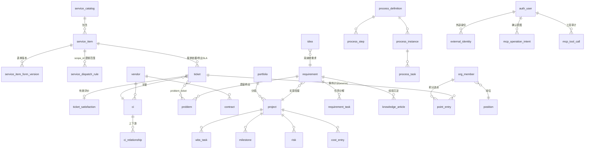

# ITOM 数据模型设计

> 依据 [03-PRD.md](03-PRD.md)（v1.2）与 [10-Aily-MCP版本交接与决策上下文.md](10-Aily-MCP版本交接与决策上下文.md)。P2 当前代码实际映射 **81 张表**：支撑 29、ITSM 16、项目 6、需求 4、流程 4、团队 22。P0 删除 4 张 Helpdesk 表并新增 4 张 MCP 支撑表；P1 新增服务项表单版本和派单规则 2 张表；P2 新增工单评价明细表 1 张。
> 对照 SN-AOM 106 表；不使用人工维护的统计预计算表。流程、绩效和配置版本快照仅用于历史可审计与可复现。
> 本文按核心契约分组说明，不逐项重列全部辅助/兼容表。Aily/MCP 支撑、动态表单、派单和评价明细模型均已实现。数据库事实以真实模型和迁移代码为准。

> 本批任务管理增强只增加读取聚合、展示和认证配置行为，不新增或删除业务表，不迁移或重写任何存量记录；`business_initial_password` 是部署配置，不是持久化业务字段。

## 0. 全局约定

- 主键：`id CHAR(26)` GLID，系统生成；下文不再逐表列出。
- 所有表含 `created_at` / `updated_at`（服务层自动维护）；业务单据表含 `is_deleted BOOLEAN DEFAULT FALSE` 软删除标记；下文不再逐表列出。
- 人员引用：统一存 `org_member.id`（外键），页面显示姓名。
- 业务编号（`*_code`）：`前缀-YYYYMM-序号`，创建时生成，唯一索引。
- 标注 **[计]** 的字段为系统计算/打点维护，无录入接口；标注 **[配]** 的表仅 admin 维护。

---

## 1. 支撑域（当前 29 表；已确认待实现目标为 30 表）

### 1.1 auth_user 登录账号

| 字段 | 类型 | 说明 |
| --- | --- | --- |
| username | VARCHAR(64) UNIQUE | 登录名 |
| password_hash | VARCHAR(255) | bcrypt |
| person_id | FK→org_member | 关联全公司人员主数据（requester 可无；不受数字化 IT 团队范围限制） |
| roles | JSONB | 角色数组，如 `["it_dev","manager"]`（一人多角色） |
| auth_source | VARCHAR(16) | local/ad/feishu/sms/wechat |
| external_id | VARCHAR(128) | 外部认证身份；飞书绑定使用 open_id，唯一占用由服务层校验 |
| preferences | JSONB | language、avatar、bio、通知分类开关、theme、density、Dashboard widget 等账号偏好 |
| is_active | BOOLEAN | |
| last_login_at | TIMESTAMP | [计] |
| password_set_at | TIMESTAMP | 密码最近一次设定时间 |
| initial_password_ciphertext | TEXT | M44 审批初始密码的 Fernet 密文；改密/重置后清空 |
| initial_password_sent_at | TIMESTAMP | 最近一次管理员手工发送初始密码邮件时间 |

**删除与绑定语义（M36–M37）**：账号删除沿用 `GlidBase.is_deleted` 软删除，同时停用账号、清空 `person_id` 并改写用户名以释放原用户名；不会删除 `org_member`。飞书解绑只清空账号的 `external_id` 并将认证源切回 local，不改变 `person_id`。

### 1.0 department / business_domain / provision_rule（M3.5 增补）

- **department**：code UNIQUE、name、parent_id 自引用、dept_type（it/business/audit）、external_source/external_id（飞书/AD 同步预留）、sort、active。一人一部门，纯数据。
- **business_domain**：code UNIQUE、name、description、owner_id FK org_member（BP 负责人，字段非角色）、backup_owner_id、sort、active。
- **business_domain_department**：domain_id FK business_domain + department_id FK department 联合唯一、include_children。表达业务域服务的组织部门范围；只允许关联启用的业务部门，部门停用时保留历史关联。
- **provision_rule**：match_type（dept_type/department）、match_value、default_roles JSONB、sort（小者优先命中即停）、active。仅账号首次开通生效。
- **org_member 变更**：删 dept/team 文本列（迁移至部门表/用户组），增 name_en、department_id FK、mobile、external_source、external_id。
- **auth_user 变更**：增 auth_source（local/ad/feishu/sms/wechat）、external_id。
- **user_group 变更**：增 roles JSONB（组授予角色，人进组自动继承）。

### 1.1a role 角色注册表 [配]（2026-07-10 增补）

code UNIQUE、name、description、base_role（自定义角色继承的内置角色 code，内置为空）、is_builtin。内置 17 个角色种子写入且代码只读；其中 `bdo`（业务数字化经理）是业务用户的受控子集，需求模块权限仅授予该角色而非 `requester`。自定义角色经 base_role 继承 API 权限，可被 workflow_transition.allowed_roles 与 process_step.default_role 引用。

### 1.1b user_group / user_group_member 用户组（2026-07-10 增补）

user_group：code UNIQUE、name、description。user_group_member：group_id + person_id UNIQUE 联合。授权/指派引用键为 `group:组码`。

### 1.2 org_member 人员主数据

| 字段 | 类型 | 说明 |
| --- | --- | --- |
| name | VARCHAR(64) | 必填 |
| dept | VARCHAR(64) | 部门 |
| team | VARCHAR(64) | 团队分组 |
| position_id | FK→position | 岗位 |
| status | VARCHAR(16) | 在岗/离职 |
| hire_date | DATE | |
| email | VARCHAR(128) | |
| feishu_user_id | VARCHAR(64) | 预留，飞书集成用 |
| skills | JSONB | 技能标签数组 |
| remarks | TEXT | |

### 1.3 workflow_status 状态定义 [配]

entity_type（ticket/problem/requirement/project/wbs_task/idea/hiring_need）、code、name、is_initial、is_terminal、sort。

### 1.4 workflow_transition 状态转换 [配]

entity_type、from_code、to_code、allowed_roles JSONB。后端每次状态变更前校验。

### 1.5 master_data 数据字典 [配]

category（业务线/关闭代码/需求来源/CI 类别扩展属性定义…）、code、name、sort、active。所有下拉项来源。

### 1.6 audit_log 审计日志（只增不改）

entity_type、entity_id、action、actor、summary JSONB（变更字段前后值）、created_at。

### 1.7 notification_outbox 通知发件箱

event_type、entity_type、entity_id、payload JSONB、channel（in_app/feishu_aily…）、status（pending/sending/sent/failed）、recipient_type、recipient_id、idempotency_key UNIQUE、attempt_count、next_attempt_at、provider_message_id、last_error_redacted、sent_at。站内通知和 Aily 机器人消息共用可靠发件箱；`feishu_aily` 的 payload 可为兼容旧记录的 `{text}`，或 `{message_type: interactive, card, fallback_text}`。卡片回调只含公开工单号、动作、评分和幂等键，不保存密钥、JWT、内部主键或敏感业务载荷。

### 1.8 in_app_notification 站内通知

recipient FK→org_member、title、content、link（前端路由）、read_at。顶栏铃铛数据源。`POST /api/notifications/read-all` 以当前账号的人员/账号收件标识批量更新未读记录的 `read_at`，`POST /api/notifications/clear-read` 以相同收件标识软删除已读记录；两者都不影响源业务单据。

### 1.9 attachment 通用附件

entity_type、entity_id、filename、storage_path、size、uploaded_by。合同附件、项目文档、章程原件共用。

### 1.10 external_identity 外部身份映射 [P0 已实现]

provider（feishu/…）、tenant_id、app_id、subject_type（open_id/user_id/union_id）、subject_id、auth_user_id FK（待映射时可空）、status（pending/active/disabled）、verified_at、last_used_at。唯一约束 `(provider, tenant_id, app_id, subject_type, subject_id)`；Aily JWT 验签通过但租户或用户尚未批准时只登记 `pending` 候选，不授予工具访问，管理员选择 ITOM 账号并激活后才成为授权映射。同一 ITOM 账号可以关联 OAuth 应用和 Aily 机器人应用的多个标识，不假定跨应用 `open_id` 相同。

### 1.11 aily_integration_config Aily/MCP 配置 [配][P0 已实现]

单行配置：enabled、mcp_auth_mode、mcp_jwt_secret_encrypted、allowed_tenant_ids JSONB、allowed_agent_ids JSONB、allowed_origins JSONB、bot_app_id、bot_app_secret_encrypted、api_base、public_base_url、message_enabled、card_callback_verification_token_encrypted、card_callback_encrypt_key_encrypted、last_test_at、last_test_status、last_error_redacted。`public_base_url` 保存管理员填写的公网访问根地址（当前 IDC 示例为 `https://itom.snnc.cc:30443`），仅允许协议、域名/IP 和可选端口，不包含 `/mcp/` 或回调路径；管理页面据此生成 MCP、飞书登录和卡片回调地址。两个卡片回调秘密必须成对配置；任一缺失时主动消息继续使用纯文本。MCP JWT Secret、Bot App Secret、Verification Token 和 Encrypt Key 均以 Fernet 密文保存，读取接口只返回是否已配置，不返回密文或明文。旧 `card_action_skill_id` 不再属于运行时模型或配置契约，存量数据库中的遗留列即使尚未物理删除也不会被读取。

### 1.12 mcp_tool_call MCP 工具调用审计 [审][P0 已实现]

call_id UNIQUE、tool_name、tenant_id、agent_id、external_subject（标识类型 + SHA-256，不保存完整外部用户 ID）、auth_user_id、session_ref_hash、request_digest、result_code、entity_type、entity_id、duration_ms、created_at。只保存脱敏摘要，不保存 JWT、App Secret、完整提示词或敏感表单答案。

### 1.13 mcp_operation_intent 写操作确认与幂等 [P1 已启用]

intent_id UNIQUE、tool_name、auth_user_id、normalized_payload JSONB、payload_digest、token_hash、idempotency_key、status（prepared/executed/expired）、expires_at、consumed_at、result_entity_type、result_entity_id、result_snapshot JSONB。唯一约束 `(auth_user_id, tool_name, idempotency_key)`；原始确认凭证不落库，重复提交返回首次执行结果。

### 1.13a record_relation 通用跨单据关联 [阶段 B/C 已实现]

`id`、`source_entity_type`、`source_entity_id`、`target_entity_type`、`target_entity_id`、`relation_type`、`reason`、`created_by FK→auth_user`、`idempotency_key`、`request_digest`、`created_at`、`deleted_at`、`deleted_by FK→auth_user`、`delete_reason`。实体组合与 `relation_type` 必须由领域服务白名单校验，首期只允许 `service_request→incident(upgraded_to_incident)`、`service_request/incident→problem(root_cause_of)`、`incident/problem→change(remediated_by_change)`、`requirement→project(converted_to_project)`；不接受任意客户端多态组合，不允许同一实体记录自关联（允许同为 `ticket` 的服务请求→事件）。阶段 C 将经 Pydantic 规范化的目标表单和关联说明写入 `request_digest`；提交在来源行锁持有期间先查同一操作者/来源/目标实体类型/幂等键，命中同摘要则返回首个目标、不同摘要拒绝，未命中才由目标领域服务创建目标并写关联。

活动关系的 `(source_entity_type, source_entity_id, target_entity_type, target_entity_id, relation_type)` 唯一；同一创建人、来源、目标类型和 `idempotency_key` 唯一，`request_digest` 用于拒绝同键异参。源、目标分别建立组合索引，支持详情页双向查询。此模型不设置跨多表多态 FK；读取服务复核实体与双方数据范围，创建服务在目标领域校验、目标创建、关系和审计的同一事务中复核字段、权限、流程与审批。现有 `problem_ticket`、`Ticket.problem_id` 及历史需求/项目关联保持原状，不迁移、不回填、不覆盖；首期不开放解除关系。

---

## 2. ITSM 域（P2 当前 16 表）

### 2.1 service_catalog 服务目录 [配]

code、name、tier（gold/silver/bronze）、description、sort、status。

### 2.2 service_item 服务项 [配]

| 字段 | 类型 | 说明 |
| --- | --- | --- |
| item_code | UNIQUE | 自动 |
| name | VARCHAR(128) | 必填 |
| catalog_id | FK→service_catalog | 必填 |
| service_type | VARCHAR(32) | 字典 |
| owner | FK→org_member | |
| description | TEXT | |
| sla_response_hours / sla_resolution_hours | FLOAT | 覆盖 SLA 策略默认值，可空 |
| target_audience | VARCHAR(128) | |
| search_keywords / search_synonyms | JSONB | Aily 检索词和同义表达 [P1] |
| typical_scenarios / exclusion_scenarios | JSONB | 典型适用与排除场景 [P1] |
| active_form_version_id | FK→service_item_form_version | 当前发布表单版本 [P1] |
| process_definition_id | FK→process_definition | 当前绑定流程 [P1] |
| default_priority | VARCHAR(8) | 默认 P1–P4 紧急程度 [P1] |
| status | VARCHAR(16) | 上架/下架 |

### 2.3 ticket 工单（单表多类型；普通用户只创建 service_request）

| 分组 | 字段 | 说明 |
| --- | --- | --- |
| 创建必填 | title, ticket_type(incident/service_request/change), priority(P1-P4), description, service_item_id FK | 服务请求界面将 priority 展示为紧急程度，并在服务类别下选择服务项 |
| 询前单字段 | service_category, other_info | 服务类别保存 ITSM 服务目录名称；其他补充信息与内部备注分开 |
| 创建可选 | assignee FK, ci_id FK, remarks | assignee/remarks 在 IT 内部角色和管理员的内部处理信息中使用 |
| 变更条件字段 | change_type, risk_level, change_reason, rollback_plan, planned_start_at, planned_end_at, implementation_plan | 仅 change 类型 |
| 阶段字段 | solution, root_cause, closure_code, satisfaction(1-5) | 解决/关闭/回访时 |
| 审批 [计] | approved_by, approved_at, approval_comment | 变更审批写入 |
| 派生 [计] | ticket_code, status, submitter, submitter_dept, service_line, submitted_at, first_response_at, resolved_at, closed_at, paused_minutes(挂起累计，SLA 扣除), reopen_count, first_time_fix, sla_response_min, sla_resolution_hours, sla_response_met, sla_resolution_met | |
| 关联 | problem_id FK→problem(升级后回写), requirement_id FK→requirement, process_instance_id | |
| 动态表单 [P1] | request_data JSONB, request_form_version_id, request_form_snapshot JSONB | 保存答案和提交时定义快照，服务项改版不改写历史 |
| 派单/受理事实 | dispatch_rule_id, dispatch_source, assigned_at, accepted_at | P1 写命中规则、来源和派单时间；P2 在首次进入处理中时写实际受理时间 |
| 用户确认 | confirmation_due_at, suspected_major_impact | P2 从当前用户确认任务的 SLA 截止时间写待确认期限；疑似大范围影响仍只作为服务请求标记 |

索引：status、assignee、service_item_id、submitted_at、(ticket_type, status)。

普通用户创建时 `ticket_type` 由领域服务固定为 `service_request`，MCP 工具不接受该参数；`incident` 仅允许 IT 人员或监控专用身份创建。`satisfaction` 保留为兼容汇总字段，由 `ticket_satisfaction` 当前有效记录回填。

### 2.13 service_item_form_version 服务项表单版本 [配][P1 已实现]

service_item_id FK、version、status（draft/published/retired）、schema JSONB、published_by、published_at、checksum。`schema` 定义字段 code、类型、标题、必填、默认值、长度/数值/日期范围、选项、人员/部门范围、条件显示/必填、帮助文字和敏感级别。唯一约束 `(service_item_id, version)`；已被工单引用的发布版本不可物理删除。

### 2.14 service_dispatch_rule 服务派单规则 [配][P1 已实现]

name、scope_type（service_item/catalog/global）、scope_id、target_type（group/member）、target_id、strategy（round_robin/fixed/manual_queue）、priority、active、fallback、last_assigned_member_id、last_assigned_at。服务项不重复保存“当前规则 FK”，而是按 `scope_type + scope_id` 解析：服务项规则优先，其次目录默认规则和全局兜底；规则执行结果写入工单派单事实。

### 2.15 ticket_satisfaction 工单评价 [P2 已实现]

ticket_id FK UNIQUE、score（1-5，数据库 CHECK）、tags JSONB、comment、source（web/aily/feishu_card）、rated_by FK→auth_user、rated_at、updated_at。每张工单只有一条有效评价；再次评价更新同一行并写 `satisfaction_create/satisfaction_update` 审计。`ticket.satisfaction` 同步保存当前 score 以兼容既有统计。

### 2.4 problem 问题

problem_code[计]、title、description、priority、status[计]、service_item_id FK 可选、root_cause（阶段）、workaround（阶段）、source_ticket_id FK、source_requirement_id FK（需求遗留转入时写）。

### 2.5 problem_ticket 问题-工单关联

problem_id + ticket_id，UNIQUE 联合。支撑"同根因多工单挂接"。

### 2.6 ci 配置项（合并原 9 张表）

| 字段 | 类型 | 说明 |
| --- | --- | --- |
| ci_code | UNIQUE | 自动 |
| name | VARCHAR(128) | 必填 |
| category | VARCHAR(32) | 必填，9 类（字典） |
| status | VARCHAR(16) | 必填，默认"运行中" |
| owner | FK→org_member | 必填；技术负责人，负责技术运行与维护 |
| environment | VARCHAR(16) | 生产/测试/开发 |
| business_owner | VARCHAR(64) | |
| vendor_id | FK→vendor | |
| description / launch_date / remarks | | |
| attrs | JSONB | 类别专属属性（属性名由 master_data 按类别定义） |

`product_manager_id` FK 表示**应用系统**的产品经理，负责 Bug 确认和验证关闭；与所有类别均必填的 `owner`（技术负责人）职责不同，但可以指向同一人。新建或编辑应用时必须维护该值；历史非应用记录的遗留值保留审计但不在页面展示。Bug 登记时从所属系统读取并保存产品经理快照；后续修改 CI 产品经理不会改写历史 Bug。

### 2.7 ci_relationship

source_ci_id、target_ci_id、relation_type（运行于/依赖/连接），UNIQUE(source, target, type)。

### 2.8 sla_policy SLA 策略 [配]

priority（P1-P4，UNIQUE）、response_minutes、resolution_hours、active。服务项字段可覆盖。

### 2.9 vendor 供应商

code[计]、name、contact、phone、email、service_scope、rating、status、remarks。

### 2.10 contract 合同

code[计]、name、vendor_id FK、amount_10k、start_date、end_date、owner FK、status[计]（生效/临期/过期，按日期推）、remarks。附件走 attachment。

### 2.11 knowledge_article 知识文章

article_code[计]、title、content（Markdown）、tags JSONB、status（草稿/已发布）、author[计]、view_count[计]、helpful_count[计]、linked_ticket_ids JSONB、source_requirement_id FK（需求经验转入时写）。

### 2.12 knowledge_vote 知识点赞（防重复）

article_id + person，UNIQUE 联合。触发"被点有用"积分。

---

## 3. 项目域（6 表）

### 3.1 portfolio 项目组合

code[计]、name、owner FK、year、description、status。

### 3.2 project 项目

| 分组 | 字段 |
| --- | --- |
| 创建必填 | name, pm FK, planned_start, planned_end；created_by FK（创建账号，流程首节点回改/删除授权依据） |
| 创建可选 | portfolio_id FK, description, budget_10k, service_item_id FK |
| 阶段 | latest_update（一句话动态） |
| 派生 [计] | project_code, status, actual_start, actual_end, progress_pct（WBS 加权）, health_status（绿/黄/红，按 PRD 6.1 规则）, actual_cost_10k（cost_entry 汇总） |

> progress_pct / health_status / actual_cost_10k 为**冗余计算列**：任务/成本/里程碑变更时服务层同步重算写回（保证列表筛选性能），非用户维护。

### 3.3 wbs_task WBS 任务

project_id FK、parent_task_id FK 自引用、wbs_code[计]（树位置生成）、task_name、assignee FK、start_date、end_date、status、description、deliverable、predecessors JSONB（任务 id 数组）、progress_pct（0-100% 整数，项目汇总按工期加权）、sort。

### 3.4 milestone 里程碑

project_id FK、name、target_date、actual_date、description、status[计]（待达成/已达成/已逾期）。

### 3.5 risk 风险

project_id FK、title、probability（高/中/低）、impact（高/中/低）、response_plan、owner FK、status（开放/已缓解/已关闭）。

### 3.6 cost_entry 成本明细

project_id FK、wbs_task_id FK 可空、date、amount_10k、description、created_by[计]。

---

## 4. 需求与任务域（5 表）

### 4.1 requirement 需求

| 分组 | 字段 |
| --- | --- |
| 登记必填 | title, req_type（业务/功能/数据/集成/合规）, business_domain_id FK, description |
| 登记可选 | source、parent_requirement_id FK、department、expected_date、expected_effect、business_value_note |
| 评估阶段 | score_d1_strategy … score_d6_speed、decision、solution_type、prd_effort、dev_effort |
| 分析阶段 | moscow、owner FK、target_date、solution、acceptance_criteria JSONB |
| 实现阶段 | project_id FK（可选挂接） |
| 派生 [计] | requirement_code、status（registered/evaluating/analyzing/implementing/closed 等）、requester/requester_name、registered_at/evaluating_at/analyzing_at/implementing_at/closed_at、closure_note |

### 4.2 requirement_task 需求任务

`requirement_id` FK、`name`、`description`、`assignee` FK、`plan_date`、`plan_effort`、`actual_effort`、`status`（待处理/进行中/已完成）、`done_at`[计]。同一需求允许多行任务，任务记录继续使用 `GlidBase.is_deleted` 软删除，不通过本次权限修复重建、覆盖或迁移存量数据。

### 4.3 bug 缺陷单

`bug_code`[计]、`title`、`description`、`priority`、`status`、`ci_id` FK（所属系统选项来自 CMDB）、`product_manager_id` FK（所属系统产品经理快照）、`dev_leader_id` FK、`reporter_id`、`source_type/source_id`、复现条件、期望/实际结果、环境、证据、解决说明、验证说明、驳回理由、重开/关闭时间。Bug 使用独立流程，不复用 `problem` 问题管理表。

### 4.4 bug_fix_task Bug 修复任务

`bug_id` FK、`name`、`task_type`（开发/测试/其他）、`description`、`assignee` FK、`plan_start`、`plan_date`、`plan_effort`、`actual_effort`、`status`（登记/排期/执行/暂停/关闭）、`done_at`、`completion_note`。一个 Bug 允许多条开发或测试任务，全部必要子任务关闭后才允许进入产品经理验证。

### 4.5 work_task 委派任务

`task_code`[计]、`title`、`description`、`task_type`、`source_type/source_id`、`registrar` FK、`assignee` FK、`priority`、`plan_start`、`plan_date`、`plan_effort`、`actual_effort`、`status`（登记/排期/执行/暂停/关闭/中止）、`performance_bucket`、暂停/中止理由、完成说明、关闭时间。来源可以关联工单、问题、事件、Bug，也可以是手工技术研究或其他 IT 工作。

委派任务仅允许登记且未分配的登记人删除；分配后至关闭前仅管理员可删除。删除为软删除并写审计，管理员可在清单页编辑、暂停、中止和关闭。

> 关闭转出不需要独立表：`problem.source_requirement_id` 与 `knowledge_article.source_requirement_id` 双向可查。

---

## 5. 流程域（4 表）

### 5.1 process_definition 流程定义 [配]

code、name、entity_type（关联单据类型）、trigger_condition JSONB（如 `{"ticket_type":"change"}`）、version、active、description。初始 seed 6-8 条。Aily + MCP 目标版本允许 `service_item.process_definition_id` 显式选择发布流程；未绑定时才回退到现有 entity_type + trigger_condition 匹配。

### 5.2 process_step 流程步骤 [配]

definition_id FK、seq、step_code（版本内稳定节点编码）、name、node_type（processing 处理节点 / approval 审批节点）、default_role（R 主责：it_bp/it_pdm/it_pm/it_dev/it_ops/is_mgr/manager；Bug 开发修复节点为空，由修复子任务负责人实际执行）、cc_roles（I 知会角色/用户组）、autonomy_level（L1-L4）、sla_hours、description。已有实例后不可就地改变 step_code、节点类型、处理人、知会关系或 SLA。

### 5.3 process_instance 流程实例

definition_id FK、entity_type、entity_id（触发单据）、status（进行中/已完成/已终止）、current_step_seq[计]、started_at、completed_at。

### 5.4 process_task 流程任务

instance_id FK、step_id FK、definition_version、step_code_snapshot、raci_snapshot JSONB（任务生成时的 R/A/C/I 快照）、assignee FK（默认角色解析，可改派）、status（待处理/进行中/已完成/已跳过）、started_at、due_at[计]（按步骤 SLA）、`viewed_at`、`viewed_by` FK（当前处理人的首次实际查阅事实）、`upstream_correction_enabled`（新任务为 true；升级前存量待办默认为 false）、completed_at、completed_by FK、comment。`started_at` 仅代表任务生成/派发，不能替代实际查阅；快照和查阅事实共同保证流程版本、绩效口径及回改窗口的历史可审计性。

---

## 6. 团队域（10 表）

### 6.1 position 岗位定义

position_code、name、position_family、service_domains JSONB、primary_roles JSONB、level_framework、location_scope、skills、duties TEXT（分工职责）、headcount INT（正式编制数）、contractor_allowed、status、sort。正式在岗人数与缺口为计算字段：缺口 = headcount − 正式在岗人数；外包/实习人员不计入正式编制。

### 6.2 hiring_need 招聘需求

position_id FK、level（高级/中级/初级）、count、qualification、status（待招聘/面试中/已到岗/已取消）、progress_note、closed_at。一个岗位可关联多条不同级别或批次的招聘需求。

### 6.3 development_activity 培训活动

activity_type（内部交叉培训/外部技术交流/新技术研究）、topic、activity_date、host_id FK（主讲/组织人）、participant_ids JSONB（org_member id 数组，积分对象冻结快照）、participant_department_selections JSONB（`[{id,name,member_ids}]`，整部门选择的部门显示与当时人员范围快照）、output_link、remarks、created_by FK→auth_user。清单优先显示部门快照与部门范围外个人；积分始终按 `participant_ids` 计发，部门后续调岗、改名或新增成员不回溯影响历史活动。存量活动不回填部门快照，继续按原人员名单展示。登记即触发主讲/参与培训积分事件；`created_by` 由当前登录账号写入，存量记录从最早创建审计日志幂等回填。删除活动和重算积分均采用软删除，保留来源、审计和历史积分流水。

### 6.4 team_charter 团队文化

section（vision/goals/code_of_conduct，UNIQUE）、content（富文本）、updated_by[计]。

### 6.5 idea 建言献策

idea_code[计]、title、description、submitter[计]、status（已提交/已采纳/已实现/已婉拒）、like_count[计]、adopted_by、adopted_at[计]、linked_requirement_id FK（采纳转需求时写）。

### 6.6 idea_like 建言点赞

idea_id + person，UNIQUE 联合。

### 6.7 point_rule 积分规则 [配]

rule_code、name、event_type（UNIQUE，见 05 文档事件清单）、points INT（可负）、contribution_bucket（`role_result`/`team_contribution`）、contribution_dimension、target_scope JSONB、active、description。

`role_result` 规则用于岗位职责结果，`team_contribution` 规则用于固定 20% 团队贡献；同一事件只能归入一个桶。活动积分排行榜、个人活动积分和团队总览积分排行只聚合 `team_contribution`，不会把岗位结果流水再次展示为活动积分。当前考核期展示时，自动活动事件使用当前有效规则的分值；规则停用显示为 0。

### 6.8 point_entry 积分流水（只增）

person FK、event_type、points、rule_id FK、contribution_bucket、contribution_dimension、period、source_entity_type、source_entity_id、earned_at、remark、created_by、idempotency_key。索引：(person, period)、(person, earned_at)、event_type。`points` 保存授予时原始分值，流水只增；当前考核期的活动积分读模型可按当前有效规则计算展示值，历史周期和已发布/锁定绩效仍使用原值，不通过修改历史记录纠正已发布绩效。

### 6.9 performance_period 考核期 [计]

period_code（如 `2026-Q3`）、version、status（draft/auto_scored/external_input/manager_review/cio_review/published/locked）、rule_snapshot JSONB、role_snapshot JSONB、published_at、locked_at、created_by、updated_by。

### 6.10 performance_role_profile / performance_role_dimension 角色评分档案 [配]

角色档案：role_code、name、line_type（business/professional/platform）、review_mode（manager_review/cio_direct）、description、active。角色维度：profile_id FK、dimension_code、name、weight、source_config JSONB、evidence_required、sort、active。启用维度权重必须合计 100%。

### 6.11 performance_role_assignment 角色周期快照 [计]

period_id FK、person FK、`role_code`（实际实现的周期角色标识，不依赖 `role_profile_id` 外键）、line_type、business_domain_id/professional_group_id、role_weight、evaluator_ids JSONB、`evaluator_weights` JSONB（评审人权重合计 100%）、review_scope JSONB、review_mode、snapshot_detail JSONB。周期发布后不可直接改写。

### 6.12 performance_external_input 外部原数据 [录]

period_id FK、metric_code、target_type、target_id、evaluator_name、evaluator_department、raw_score、raw_scale、normalized_score [计]、comment、evidence_refs JSONB、inputter_id、status（draft/submitted/verified/locked）、version、locked_at。外部业务满意度与 ITSM 内部满意度分开保存；锁定后只能建立修订版本。

### 6.13 performance_score_component 评分组件 [计]

period_id FK、assignment_id FK、dimension_code、system_score [计]、business_manager_score、professional_manager_score、cio_score、manager_scores JSONB、manager_reasons JSONB、manager_evidence_refs JSONB、effective_score [计]、reason、evidence_refs JSONB、updated_at。评审人先独立保存分数，再按快照权重计算业务/专业负责人初评；系统参考分、各阶段建议分和生效分分开保存。

### 6.13a performance_contribution_config 团队贡献规则 [配]

单例配置：`weights` JSONB、`targets` JSONB、`internal_satisfaction_weight`、`external_satisfaction_weight`、`updated_by`。CIO/系统管理员可通过 `/api/admin/performance/contribution-rules` 调整；重新取数时写入 `performance_period.rule_snapshot`，已发布周期不受后续配置变更影响。

### 6.14 performance_review_action 评审动作 [审]

period_id FK、assignment_id FK、actor_id、stage、action、before_value JSONB、after_value JSONB、reason、evidence_refs JSONB、created_at。只增不改，用于记录初评、终审、提交、退回、发布、解锁和新版本生成。

### 6.15 performance_score 人效评分结果 [计]

period_id FK、person FK、version、business_role_score、professional_role_score、team_contribution_score、regular_score、bonus、penalty、published_score、detail JSONB、published_at。仅发布时生成对外结果快照；`/api/my/performance` 只能读取已发布版本。

---

## 7. 核心关系图

## 8. 与设计原则的对账

| 原则 | 落实 |
| --- | --- |
| 无预计算表 | 业务统计不使用手工预计算表；project 三个计算列与 performance_score 为"系统维护的计算结果"，UI 品牌版本表是配置快照而非业务统计 |
| 极简录入 | 每表"创建必填"分组 ≤ 5 字段 |
| 事件驱动 | notification_outbox + point_entry 由同一领域事件出口写入 |
| 防重复 | idea_like / knowledge_vote 唯一约束 |
| Aily/飞书边界 | external_identity 隔离应用级标识；notification_outbox 提供可靠机器人消息；mcp_operation_intent 提供确认和幂等 |

## 9. UI 品牌配置（M38）

### 9.1 ui_branding_version

完整配置快照：`version`、`status(draft/published)`、`config JSONB`、`published_by`、`published_at`，继承 GLID、审计时间与软删除字段。草稿保持单份；每次发布或回滚都新增不可变的 published 版本，线上读取最新版本。

### 9.2 ui_branding_asset

受控图片资源：`kind`、`filename`、`storage_path`、`content_type`、`size`、`width`、`height`、`uploaded_by`。仅接受 PNG/JPEG/WebP/ICO、最大 5 MB、最大 4096×4096；禁止 SVG、任意 HTML/CSS/JS 与远程字体，避免登录门户成为脚本注入入口。
### 1.8 组织治理配置（M42）

`org_settings` 为单行配置：`digital_team_department_ids` 保存数字化团队根部门数组，`digital_team_member_ids` 保存从其他/混合组织中单独纳入的人员数组，`digital_team_include_children` 控制是否展开所选部门后代。有效数字化团队为“部门展开后的在岗成员 ∪ 单独指定的在岗人员”；指定人员不会把其所在部门的其他人员一并纳入。`feishu_auto_sync_enabled`、`feishu_auto_sync_interval_minutes` 与 `feishu_auto_sync_last_attempt_at` 控制飞书自动同步。配置独立于飞书凭据表，避免更换组织来源时丢失内部团队口径。

### 1.9 系统集成配置（M44）

`system_integration_config` 为单行配置，`email_config` 与 `ldap_config` 保存全局集成参数；SMTP 密码和 LDAP 绑定密码以 Fernet 密文保存，读取 API 仅返回 `has_secret`。

### 1.14 feishu_config 与 Helpdesk 清理（Aily + MCP 基线）

`feishu_config` 只保留飞书 OAuth、工作台免登、组织同步和通用应用凭据；删除全部 `helpdesk_*` 字段。Aily 机器人应用可能与登录/组织同步应用不同，因此其凭据和允许的租户/Agent 放在独立 `aily_integration_config`，不得默认复用同一 `open_id`。

删除 `feishu_helpdesk_handoff`、`feishu_helpdesk_intake`、`feishu_helpdesk_sync_event` 和 `feishu_helpdesk_outbox`。用户已确认当前没有需要迁移或归档的生产历史数据；迁移只需安全删除专用表/字段并保留冻结标签的可恢复性。

### 1.15 网页智能体目标模型（WA0，设计已确认）

网页智能体采用新增结构，不复用或改写 `aily_integration_config`。WA0 已新增以下表，全部继承 GLID、审计时间与软删除字段；模型提供方和档案默认关闭：

- `ai_provider_config`：唯一 `code`、提供方类型、模型连接、加密 API Key、超时/输出限制、能力探测、主备、`enabled=false` 及从 1 开始的 `config_revision`；类型、URL、模型、非空新密钥、超时、输出限制、温度或备用关系变化时在治理锁内递增修订号并使旧探测失效。探测状态可查询，但修订号不基于密钥散列，密钥也不进入普通读取结果。
- `ai_agent_profile` / `ai_agent_profile_version`：唯一档案 `code`、受众、当前活动默认模型、最高风险等级、启用状态和 `retention_days`；档案保留期数据库默认 30 天，并由数据库 `CHECK` 约束为 0–90 天。版本以 `(profile_id, version)` 唯一，保存中英文系统指令、已启用能力、知识范围、发布人、发布时刻及 `config_snapshot`。所有新草稿、发布版本和回滚副本都以 `schema_version=1` 保存完整发布控制字段 `name/default_provider_id/retention_days/enabled`；草稿 PATCH 只修改版本快照，成功发布/回滚才把快照和版本风险原子应用到活动档案行。运行时只有完整快照、双语提示、注册能力/风险、近期健康兼容提供商以及活动行与最新版本一致时才可用；既有 `{}`、缺少 schema 标记或字段不全的历史版本均不可证明并失败关闭，绝不以当前活动档案补齐历史。
- `ai_conversation` / `ai_message`：网页当前 `auth_user` 的档案/版本、语言、严格白名单页面上下文、生命周期状态/归档时刻/`expires_at`，以及脱敏结构化消息、角色、Token 用量和耗时。所有读取和归档以 `auth_user_id` 限定；归档只改变会话可见状态。普通消息的保留期只能从会话创建时捕获的 `profile_version_id` 的完整 schema 标记快照读取，不能由活动档案或 `expires_at` 推断：捕获版本为 0 时永久不写正文，即使后来再发布为正值；捕获版本为 1–90 时保留该不可变决定和创建时稳定 `expires_at`，但当前档案停用、删除、未发布、受众不再一致或运行时校验失败时不再写新正文。Task 7 不新增字段或迁移：用户消息先以 `accepted` 保存；只有在有界 DB worker 新建的短事务中按 `AuthUser → AiConversation → 当前档案/版本 → AiMessage` 固定顺序锁定后，递归脱敏的最终结构化正文才可成为 `completed`。其中 `AuthUser` 必须先 `FOR UPDATE + populate_existing` 并在锁后校验 active/deleted；会话必须仍属本人且 active，档案/版本必须仍是精确当前发布，助手占位必须仍为 `streaming`。最终化在锁齐后及写 `completed`、commit 前合作式检查断流/绝对 deadline 取消；已观察取消时 rollback，不写完成态，但不宣称消除真实 socket/线程调度的全部微小竞态。整轮只创建一个 monotonic absolute deadline，失败占位清理和所有 pre-commit 阶段共享同一预算且 timeout 不会重置或相加；权威 commit 必须在 deadline 前、最后一次取消检查通过后开始。一旦进入该提交阶段，调用方等待 commit 与 Session 收尾以保证数据库 `completed` 和客户端终态一致，因此可能小幅越过 deadline，不把已持久化完成态改报超时。模型自由文本的持久化合同固定为 `authority=advisory, operation_status=not_executed`；L3 准备结果固定为 `authority=server_preview, operation_status=prepared_not_executed`，二者都不是已提交业务结果。提供商错误、截断协议、断流和 partial delta 不作为完成回答保存；失败/取消只可保留无敏感正文状态事实，保留期 0 只保存正文为空的幂等元数据和摘要。`request_digest` 是服务端密钥 HMAC：输入为规范化原始 `content + page_context`，只持久化摘要，不持久化密钥或因此新增原文；正文仍按原规则脱敏。因此同一 `client_message_id` 的同一原始请求安全重放，原始不同但脱敏后相同的请求也必须冲突。L3 `prepared` 动作可在断流后保留至过期，但绝不因流式阶段自动执行。本轮仍不新增表、字段、索引或迁移。
Task 7A 不改变上述表或状态枚举，只修复 `completed` 的最终化权威判定：线程安全 durable-success 仅在 `db.commit()` 成功返回后设置；其后的 Session close 异常只保存脱敏异常类型，不能反向否定已持久化状态，也不通过重查数据库猜测事务结果。commit 已开始后观察到断流时取消语义优先且不再发送 SSE 终态；commit 自身失败则不设置 durable-success，事务 rollback 后由既有失败占位清理把非完成行安全收敛为 `failed`。
- `ai_action`：会话、发起账号、能力、风险等级、经注册 Pydantic 模型规范化且通过敏感碰撞检查的安全参数、稳定 SHA-256 摘要、确认凭证 SHA-256、幂等键、状态、结果和关联实体；SQLAlchemy 元数据与 PostgreSQL DDL 统一命名唯一约束 `uq_ai_action_user_capability_idempotency(auth_user_id, capability_code, idempotency_key)`。递归脱敏若会改变规范化参数则整次拒绝，不保存或执行脱敏替代值。Task 6 不新增字段或迁移：首次准备只在独立回滚预览 Session 结束后保存 `prepared` 与服务端 handler 预览并只返回一次原始 Token；同键同摘要读取既有 `prepared/succeeded/failed/cancelled/expired` 状态，同键异摘要拒绝，命名约束竞态恢复只重载其赢家。确认锁行并证明归属会话捕获档案仍是当前完整发布版本、提供商仍健康兼容，再校验能力和载荷摘要；成功以同一事务写 `succeeded`、`consumed_at`、脱敏结果/实体和通用 `audit_log`。取消写 `cancelled`，过期写 `expired`。处理器或成功审计失败只回滚嵌套 savepoint，再在保持同一动作行锁的外层事务写有界 `failed`；失败状态提交失败时不宣称已持久化。`token_hash` 可保留作安全审计但不可逆、不可回显；任何状态都不把原始 Token 写入消息、日志或审计。

Task 8C 不改列或迁移，但补充状态契约：`prepared` 是唯一可确认/可取消状态；`executing` 是确认凭证和运行时检查通过后、handler 前已提交的内部不可重试声明，绝不表示业务成功；`succeeded` 仍只在领域变更、结果和审计同一事务成功后出现。若 handler 或最终持久化结果不确定，行保持 `executing` 而不回退 `prepared`；已知失败且终态提交成功才写 `failed`。`expires_at` 继续以 naive UTC `TIMESTAMP` 保存，所有公开 `confirmation_expires_at`/`expires_at` 线缆值统一为显式 `Z` 的 RFC 3339 UTC。

Round 1 明确 SQLite 也必须在 handler nested savepoint 前拥有 claim 后的外层写事务：若 success 终态 commit 失败或不确定，领域 mutation、`succeeded` 和成功审计均回滚，已提交的行仍为 `executing`；仅 claim commit 未开始 handler 时可保留原 `prepared` 和原 Token 供诚实重试。
- `ai_provider_call`：提供方、会话/消息/档案版本、模型、用途、输入/输出 Token、耗时、结果码、状态及脱敏错误元数据。

能力处理器由代码注册，数据库只能关闭已注册能力，不能创建可执行处理器。启动迁移 `ensure_assistant_schema()` 仅在 PostgreSQL 执行 `CREATE TABLE IF NOT EXISTS`、缺列补齐（包括 `ai_provider_config.config_revision INTEGER NOT NULL DEFAULT 1` 和 `ai_agent_profile_version.config_snapshot JSONB NOT NULL DEFAULT '{}'`）、`CREATE INDEX IF NOT EXISTS` 及幂等追加的保留期 `CHECK` 约束；SQLite 测试库仍由 `Base.metadata.create_all()` 建表。迁移不回填、不重算、不改写或伪造既有 `config_snapshot`，也不改写业务数据、流程实例、Aily 外部身份或 MCP 审计；因此 legacy `{}` 会原样保留并按上述一次性兼容限制失败关闭。对话默认保留 30 天并允许管理员在 0–90 天内配置；归档或保留期清理绝不删除 `ai_action` 或其他安全/业务审计。完整字段与安全约束见 [`docs/superpowers/specs/2026-08-01-itom-web-agent-design.md`](superpowers/specs/2026-08-01-itom-web-agent-design.md)。

Task 8C Round 2 不改数据库列或迁移；它明确公开 expiry 的浏览器解析合同为“显式 `Z` 且日历有效”，因此规范化非法日期/时间不得形成可确认的 `prepared` 状态。
