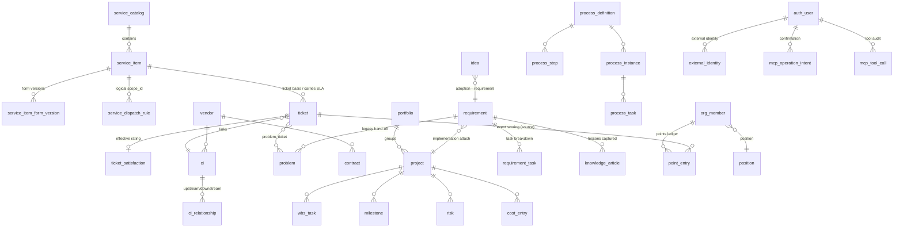

# ITOM Data Model Design

> English translation of [../04-数据模型设计.md](../04-数据模型设计.md). For the authoritative version, the Chinese source prevails.

> Based on PRD v1.2 and the approved Aily + MCP baseline. P2 code maps **81 tables**: Support 29, ITSM 16, Project 6, Requirement 4, Process 4, Team 22. P0 removed four Helpdesk tables and added four MCP support tables; P1 added form-version and dispatch-rule tables; P2 adds one ticket-rating detail table.
> Compared with SN-AOM's 106 tables, there are no manually maintained statistics tables. Process, performance, and configuration snapshots exist only for auditable, reproducible history.
> This document groups core contracts and does not relist every auxiliary/compatibility table. Aily/MCP support, dynamic-form, dispatch, and rating-detail models are implemented. Database facts must be checked against real models and migrations.

> This task-management enhancement changes only read aggregations, presentation, and authentication configuration. It adds or deletes no business table and rewrites no existing record; `business_initial_password` is deployment configuration, not a persisted business field.

## 0. Global Conventions

- Primary key: `id CHAR(26)` GLID, system-generated; not listed per-table below.
- Every table has `created_at` / `updated_at` (maintained automatically by the service layer); business-record tables have an `is_deleted BOOLEAN DEFAULT FALSE` soft-delete flag; not listed per-table below.
- Personnel references: uniformly store `org_member.id` (foreign key), displaying the name on the page.
- Business codes (`*_code`): `prefix-YYYYMM-sequence`, generated on creation, with a unique index.
- Fields marked **[C]** (computed) are system-computed/stamp-maintained with no input endpoint; tables marked **[cfg]** are maintained by admin only.

---

## 1. Support Domain (current 30)

### 1.1 auth_user — login account

| Field | Type | Description |
| --- | --- | --- |
| username | VARCHAR(64) UNIQUE | Login name |
| password_hash | VARCHAR(255) | bcrypt |
| person_id | FK→org_member | Links any company person (requester may have none; not limited by the digital-team scope) |
| roles | JSONB | Array of roles, e.g. `["it_dev","manager"]` (one person, many roles) |
| auth_source | VARCHAR(16) | local/ad/feishu/sms/wechat |
| external_id | VARCHAR(128) | External authentication identity; Feishu uses open_id |
| preferences | JSONB | language, avatar, bio, notification categories, theme, density, dashboard widgets, etc. |
| is_active | BOOLEAN | |
| last_login_at | TIMESTAMP | [C] |
| password_set_at | TIMESTAMP | Last password setup |
| initial_password_ciphertext | TEXT | Fernet ciphertext for the M44 provisioning password; cleared after change/reset |
| initial_password_sent_at | TIMESTAMP | Last administrator-triggered initial-password email time |

**M36–M37 lifecycle semantics**: account deletion uses `GlidBase.is_deleted`, disables the account, clears `person_id`, and rewrites the username to release the original value; it never deletes `org_member`. Feishu unbinding clears account `external_id` and switches the source to local without changing `person_id`.

### 1.0 department / business_domain / provision_rule (added in M3.5)

- **department**: code UNIQUE, name, parent_id self-reference, dept_type (it/business/audit), external_source/external_id (reserved for Feishu/AD sync), sort, active. One person, one department; pure data.
- **business_domain**: code UNIQUE, name, description, owner_id FK org_member (the BP owner, a field not a role), backup_owner_id, sort, active.
- **business_domain_department**: unique domain_id FK business_domain + department_id FK department, plus include_children. It records which organization departments a domain serves; only active business departments may be linked, while historical links remain when a department is later disabled.
- **provision_rule**: match_type (dept_type/department), match_value, default_roles JSONB, sort (lower matches first and stops), active. Takes effect only on first account provisioning.
- **org_member changes**: drop the dept/team text columns (migrated to the department table / user groups); add name_en, department_id FK, mobile, external_source, external_id.
- **auth_user changes**: add auth_source (local/ad/feishu/sms/wechat), external_id.
- **user_group changes**: add roles JSONB (group-granted roles; a person joining the group inherits them automatically).

### 1.1a role — role registry [cfg] (added 2026-07-10)

code UNIQUE, name, description, base_role (the built-in role code that a custom role inherits; empty for built-ins), is_builtin. The 17 built-in roles are seeded and their codes are read-only; `bdo` (Business Digital Owner) is a controlled business-user subset and the Requirement-module permission is granted to it rather than to `requester`. Custom roles inherit API permissions via base_role and can be referenced by workflow_transition.allowed_roles and process_step.default_role.

### 1.1b user_group / user_group_member — user groups (added 2026-07-10)

user_group: code UNIQUE, name, description. user_group_member: group_id + person_id UNIQUE composite. The authorization/assignment reference key is `group:<group-code>`.

### 1.2 org_member — personnel master data

| Field | Type | Description |
| --- | --- | --- |
| name | VARCHAR(64) | Required |
| dept | VARCHAR(64) | Department |
| team | VARCHAR(64) | Team grouping |
| position_id | FK→position | Position |
| status | VARCHAR(16) | Active / Departed |
| hire_date | DATE | |
| email | VARCHAR(128) | |
| feishu_user_id | VARCHAR(64) | Reserved, for Feishu integration |
| skills | JSONB | Array of skill tags |
| remarks | TEXT | |

### 1.3 workflow_status — status definitions [cfg]

entity_type (ticket/problem/requirement/project/wbs_task/idea/hiring_need), code, name, is_initial, is_terminal, sort.

### 1.4 workflow_transition — status transitions [cfg]

entity_type, from_code, to_code, allowed_roles JSONB. The backend validates before every status change.

### 1.5 master_data — data dictionary [cfg]

category (business line / closure code / requirement source / CI category extension-attribute definitions …), code, name, sort, active. The source of all dropdown items.

### 1.6 audit_log — audit log (append-only)

entity_type, entity_id, action, actor, summary JSONB (before/after values of changed fields), created_at.

### 1.7 notification_outbox — notification outbox

event_type, entity_type, entity_id, payload JSONB, channel (in_app/feishu_aily…), status (pending/sending/sent/failed), recipient type/ID, unique idempotency key, attempt count, next attempt, provider message ID, redacted last error, and sent time. `feishu_aily` payloads are either the legacy-compatible `{text}` form or `{message_type: interactive, card, fallback_text}`. Card callbacks carry only public ticket codes, actions, scores, and idempotency keys—never secrets, JWTs, internal primary keys, or sensitive payloads.

### 1.8 in_app_notification — in-app notification

recipient FK→org_member, title, content, link (front-end route), read_at. The data source for the top-bar bell. `POST /api/notifications/read-all` bulk-updates `read_at` for unread rows addressed to the current account's person/account recipient IDs; `POST /api/notifications/clear-read` soft-deletes already-read rows for the same recipient IDs. Neither action changes source business records.

### 1.9 attachment — generic attachment

entity_type, entity_id, filename, storage_path, size, uploaded_by. Shared by contract attachments, project documents, and original charter files.

### 1.10 external_identity [implemented in P0]

provider, tenant_id, app_id, subject type (open_id/user_id/union_id), subject ID, nullable auth_user_id FK while pending, status (pending/active/disabled), verified time, and last-used time. Unique `(provider, tenant_id, app_id, subject_type, subject_id)`. A JWT-verified but unapproved tenant/user is recorded only as a pending candidate and receives no tool access; it becomes authorized only after an administrator selects an ITOM account and activates it. One account may have OAuth-app and Aily-bot identities; cross-app `open_id` equality is never assumed.

### 1.11 aily_integration_config [cfg][implemented in P0]

Singleton: enabled, MCP auth mode, encrypted MCP JWT secret, allowed tenant/agent/origin arrays, bot app ID, encrypted bot secret, API base, `public_base_url`, message enabled, encrypted card-callback Verification Token, encrypted card-callback Encrypt Key, last test status/time, and redacted error. `public_base_url` stores the administrator-entered external root (the current IDC example is `https://itom.snnc.cc:30443`) and accepts only a scheme, host/IP, and optional port; it must not contain `/mcp/` or a callback path. The admin page derives the MCP, Feishu login, and card-callback URLs from it. The two callback secrets must be configured together; if either is absent, proactive delivery stays text-only. MCP JWT Secret, Bot App Secret, Verification Token, and Encrypt Key are all Fernet-encrypted, and read APIs expose configured flags only. The old `card_action_skill_id` is no longer part of the runtime model or configuration contract; an as-yet physically retained legacy column in an existing database is never read.

### 1.12 mcp_tool_call [audit][implemented in P0]

Unique call_id, tool_name, tenant/agent, external subject as subject type plus SHA-256 (never the complete external user ID), auth_user_id, session-reference hash, request digest, result code, entity type/ID, duration, and time. It never stores JWTs, app secrets, full prompts, or sensitive form answers.

### 1.13 mcp_operation_intent [active in P1]

Unique intent_id, tool, auth_user_id, normalized payload, payload digest, token hash, idempotency key, status (prepared/executed/expired), expiry/consumption times, and result entity/snapshot. Unique `(auth_user_id, tool_name, idempotency_key)`; raw confirmation tokens are not stored.

### 1.13a record_relation — generic cross-record relation [phases B/C implemented]

`id`, `source_entity_type`, `source_entity_id`, `target_entity_type`, `target_entity_id`, `relation_type`, `reason`, `created_by FK→auth_user`, `idempotency_key`, `request_digest`, `created_at`, `deleted_at`, `deleted_by FK→auth_user`, and `delete_reason`. The domain service validates entity combinations and relation type against a server-side whitelist. The first phase permits only `service_request→incident(upgraded_to_incident)`, `service_request/incident→problem(root_cause_of)`, `incident/problem→change(remediated_by_change)`, and `requirement→project(converted_to_project)`; arbitrary client polymorphic pairs and self-links to the same record are rejected (a service-request ticket may still relate to an incident ticket). Phase C stores a digest of the Pydantic-normalized target form and relation reason in `request_digest`; while holding the source-row lock, it first checks the same actor/source/target-entity-type/idempotency key, returns the first target for the same digest, rejects a different digest, and only then lets the target domain service create the target and write the relation.

Active relations are unique on `(source_entity_type, source_entity_id, target_entity_type, target_entity_id, relation_type)`. The creator/source/target-type/idempotency-key combination is also unique; `request_digest` rejects a reused key with different parameters. Combined source/target indexes support bidirectional reads. The model has no cross-table polymorphic FKs: the read service rechecks entities and visibility, while the create service rechecks fields, permission, workflow, approval, and data scope in the same transaction that creates the target, relation, and audit. Existing `problem_ticket`, `Ticket.problem_id`, and historical requirement/project relations remain unchanged, with no migration, backfill, or overwrite; no unlink action is exposed in the first phase.

---

## 2. ITSM Domain (16 in P2)

### 2.1 service_catalog — service catalog [cfg]

code, name, tier (gold/silver/bronze), description, sort, status.

### 2.2 service_item — service item [cfg]

| Field | Type | Description |
| --- | --- | --- |
| item_code | UNIQUE | Automatic |
| name | VARCHAR(128) | Required |
| catalog_id | FK→service_catalog | Required |
| service_type | VARCHAR(32) | Dictionary |
| owner | FK→org_member | |
| description | TEXT | |
| sla_response_hours / sla_resolution_hours | FLOAT | Overrides the SLA policy default; nullable |
| target_audience | VARCHAR(128) | |
| search_keywords / search_synonyms | JSONB | Aily search terms [P1] |
| typical_scenarios / exclusion_scenarios | JSONB | Included/excluded scenarios [P1] |
| active_form_version_id | FK→service_item_form_version | Active published form [P1] |
| process_definition_id | FK→process_definition | Bound process [P1] |
| default_priority | VARCHAR(8) | Default P1–P4 urgency [P1] |
| status | VARCHAR(16) | Listed / Delisted |

### 2.3 ticket — single-table ticket; normal users create service_request only

| Group | Fields | Description |
| --- | --- | --- |
| Required on creation | title, ticket_type (incident/service_request/change), priority (P1-P4), description, service_item_id FK | The service-request UI presents priority as Urgency and selects service items under a category |
| Pre-consultation fields | service_category, other_info | Stores the ITSM catalog name and supplemental information separately from internal remarks |
| Optional on creation | assignee FK, ci_id FK, remarks | Assignee/remarks are exposed in Internal Handling Information to IT staff and administrators |
| Change conditional fields | change_type, risk_level, change_reason, rollback_plan, planned_start_at, planned_end_at, implementation_plan | change type only |
| Staged fields | solution, root_cause, closure_code, satisfaction (1-5) | at resolution/closure/follow-up |
| Approval [C] | approved_by, approved_at, approval_comment | written by change approval |
| Derived [C] | ticket_code, status, submitter, submitter_dept, service_line, submitted_at, first_response_at, resolved_at, closed_at, paused_minutes (on-hold accumulation, deducted from SLA), reopen_count, first_time_fix, sla_response_min, sla_resolution_hours, sla_response_met, sla_resolution_met | |
| Links | problem_id FK→problem (back-written after escalation), requirement_id FK→requirement, process_instance_id | |
| Dynamic form [P1] | request_data JSONB, request_form_version_id, request_form_snapshot JSONB | Answers and submission-time schema |
| Dispatch/acceptance facts | dispatch_rule_id, dispatch_source, assigned_at, accepted_at | P1 records rule/source/dispatch; P2 stamps actual acceptance on first entry to processing |
| Confirmation | confirmation_due_at, suspected_major_impact | P2 takes the deadline from the active requester-confirmation task; broad impact remains a service-request flag |

Indexes: status, assignee, service_item_id, submitted_at, (ticket_type, status).

Normal-user creation fixes `ticket_type=service_request`; MCP does not accept the field. Incidents are created only by IT staff or monitoring identities. `ticket.satisfaction` remains a compatibility score populated from the effective rating row.

### 2.13 service_item_form_version [cfg][implemented in P1]

service_item_id, version, status (draft/published/retired), schema JSONB, publisher/time, checksum. Schema covers field code/type/label, required/default, length/range/date/options, person/department scope, conditional rules, help text, and sensitivity. Unique `(service_item_id, version)`; referenced versions cannot be physically deleted.

### 2.14 service_dispatch_rule [cfg][implemented in P1]

name, scope_type (service_item/catalog/global), scope_id, target_type (group/member), target_id, strategy (round_robin/fixed/manual_queue), priority, active, fallback, last-assigned member/time. A service item does not duplicate a current-rule FK; resolution uses `scope_type + scope_id` in item → catalog → global order, and records the execution facts on the ticket.

### 2.15 ticket_satisfaction [implemented in P2]

Unique ticket_id, database-checked score 1–5, tags, comment, source (web/aily/feishu_card), rater, rating time, and update time. One effective rating exists per ticket; a later rating updates the same row and writes `satisfaction_create/satisfaction_update` audit. The score is copied to `ticket.satisfaction` for existing reporting.

### 2.4 problem — problem

problem_code [C], title, description, priority, status [C], service_item_id FK optional, root_cause (staged), workaround (staged), source_ticket_id FK, source_requirement_id FK (written when a legacy requirement problem is handed off).

### 2.5 problem_ticket — problem-ticket link

problem_id + ticket_id, UNIQUE composite. Supports "multiple tickets with the same root cause attached."

### 2.6 ci — configuration item (merges the original 9 tables)

| Field | Type | Description |
| --- | --- | --- |
| ci_code | UNIQUE | Automatic |
| name | VARCHAR(128) | Required |
| category | VARCHAR(32) | Required, 9 categories (dictionary) |
| status | VARCHAR(16) | Required, default "Running" |
| owner | FK→org_member | Required; technical owner for operation and maintenance |
| environment | VARCHAR(16) | Production / Test / Development |
| business_owner | VARCHAR(64) | |
| vendor_id | FK→vendor | |
| description / launch_date / remarks | | |
| attrs | JSONB | Category-specific attributes (attribute names defined by master_data per category) |

`product_manager_id` FK identifies the **Application** product manager who confirms and verifies Bugs. It is distinct from the required all-category `owner` (technical owner), though both may be the same person. It is required when an Application is created or edited; a legacy non-Application value is retained for audit but hidden from the UI. Bug registration snapshots this person; later CI product-manager changes do not rewrite historical Bugs.

### 2.7 ci_relationship

source_ci_id, target_ci_id, relation_type (runs-on / depends-on / connects-to), UNIQUE(source, target, type).

### 2.8 sla_policy — SLA policy [cfg]

priority (P1-P4, UNIQUE), response_minutes, resolution_hours, active. Service-item fields can override.

### 2.9 vendor — vendor

code [C], name, contact, phone, email, service_scope, rating, status, remarks.

### 2.10 contract — contract

code [C], name, vendor_id FK, amount_10k, start_date, end_date, owner FK, status [C] (Active / Expiring / Expired, derived from dates), remarks. Attachments go through attachment.

### 2.11 knowledge_article — knowledge article

article_code [C], title, content (Markdown), tags JSONB, status (Draft / Published), author [C], view_count [C], helpful_count [C], linked_ticket_ids JSONB, source_requirement_id FK (written when requirement lessons are handed off).

### 2.12 knowledge_vote — knowledge vote (duplicate-proof)

article_id + person, UNIQUE composite. Triggers the "marked helpful" points.

---

## 3. Project Domain (6 tables)

### 3.1 portfolio — portfolio

code [C], name, owner FK, year, description, status.

### 3.2 project — project

| Group | Fields |
| --- | --- |
| Required on creation | name, pm FK, planned_start, planned_end |
| Optional on creation | portfolio_id FK, description, budget_10k, service_item_id FK |
| Staged | latest_update (one-line update) |
| Derived [C] | project_code, status, actual_start, actual_end, progress_pct (WBS-weighted), health_status (green/yellow/red, per PRD 6.1 rules), actual_cost_10k (rolled up from cost_entry) |

> progress_pct / health_status / actual_cost_10k are **redundant computed columns**: on task/cost/milestone changes, the service layer recomputes and writes them back synchronously (to guarantee list-filtering performance); they are not user-maintained.

### 3.3 wbs_task — WBS task

project_id FK, parent_task_id FK self-reference, wbs_code [C] (generated from tree position), task_name, assignee FK, start_date, end_date, status, description, deliverable, predecessors JSONB (array of task ids), progress_pct (integer 0–100%; project roll-up is duration-weighted), sort.

### 3.4 milestone — milestone

project_id FK, name, target_date, actual_date, description, status [C] (Pending / Achieved / Overdue).

### 3.5 risk — risk

project_id FK, title, probability (High/Medium/Low), impact (High/Medium/Low), response_plan, owner FK, status (Open / Mitigated / Closed).

### 3.6 cost_entry — cost detail

project_id FK, wbs_task_id FK nullable, date, amount_10k, description, created_by [C].

---

## 4. Requirement and task domain (5 tables)

### 4.1 requirement — requirement

| Group | Fields |
| --- | --- |
| Required at registration | title, req_type (business/functional/data/integration/compliance), business_domain_id FK, description |
| Optional at registration | source, parent_requirement_id FK, department, expected_date, expected_effect, business_value_note |
| Evaluation stage | six D1–D6 scores, decision, solution_type, PRD/dev effort |
| Analysis stage | moscow, owner FK, target_date, solution, acceptance_criteria JSONB |
| Implementation stage | project_id FK (optional attachment) |
| Derived [C] | requirement_code, status, requester/name, registered/evaluating/analyzing/implementing/closed timestamps, closure_note |

### 4.2 requirement_task — requirement task

`requirement_id` FK, `name`, `description`, `assignee` FK, `plan_date`, `plan_effort`, `actual_effort`, `status` (Pending / In Progress / Done), `done_at` [C]. A requirement may have multiple task rows. Tasks continue to use `GlidBase.is_deleted` soft deletion; this permission fix does not rebuild, overwrite, or migrate existing records.

### 4.3 bug — defect record

`bug_code` [C], `title`, `description`, `priority`, `status`, `ci_id` FK (the selectable system comes from CMDB), `product_manager_id` FK (snapshotted system product manager), `dev_leader_id` FK, `reporter_id`, `source_type/source_id`, reproduction details, expected/actual results, environment, evidence, resolution and verification notes, rejection reason, and reopen/close timestamps. Bugs use a dedicated process and do not reuse the ITIL `problem` table.

### 4.4 bug_fix_task — Bug repair task

`bug_id` FK, `name`, `task_type` (development/testing/other), `description`, `assignee` FK, `plan_start`, `plan_date`, `plan_effort`, `actual_effort`, `status` (Registered / Scheduled / Executing / Paused / Closed), `done_at`, and `completion_note`. A Bug may have multiple development or testing rows; all required child tasks must be closed before product-manager verification.

### 4.5 work_task — delegated work task

`task_code` [C], `title`, `description`, `task_type`, `source_type/source_id`, `registrar` FK, `assignee` FK, `priority`, `plan_start`, `plan_date`, `plan_effort`, `actual_effort`, `status` (Registered / Scheduled / Executing / Paused / Closed / Aborted), `performance_bucket`, pause/abort reasons, completion note, and close time. Sources may be tickets, problems, incidents, Bugs, manual technical research, or other IT work.

Only the registrar may delete an unassigned task still in Registered status. After assignment and before closure, deletion is administrator-only. Deletion is soft and audited; administrators can edit, pause, abort, and close from the list.

> No separate table is needed for closure hand-off: `problem.source_requirement_id` and `knowledge_article.source_requirement_id` are queryable both ways.

---

## 5. Process Domain (4 tables)

### 5.1 process_definition — process definition [cfg]

code, name, entity_type, trigger_condition JSONB, version, active, description. The Aily + MCP target lets `service_item.process_definition_id` select a published process explicitly; unbound items fall back to entity type plus trigger condition.

### 5.2 process_step — process step [cfg]

definition_id FK, seq, step_code (stable code within a version), name, node_type (processing / approval), default_role (R; the Bug Development Fix node is intentionally empty and executes through repair-child assignees), cc_roles (I notification roles/groups), autonomy_level (L1-L4), sla_hours, description. Once instances exist, step_code, node type, handler, CC parties, and SLA cannot be changed in place; use a new version. Approval nodes support approve (optional comment) or reject (required reason); processing nodes advance through the complete-step action.

### 5.3 process_instance — process instance

definition_id FK, entity_type, entity_id (triggering record), status (In Progress / Completed / Terminated), current_step_seq [C], started_at, completed_at.

### 5.4 process_task — process task

instance_id FK, step_id FK, definition_version, step_code_snapshot, raci_snapshot JSONB (R/A/C/I snapshot at task creation), assignee FK (resolved from default role, reassignable), status (Pending / In Progress / Done / Skipped), started_at, due_at [C] (from the step SLA), completed_at, completed_by FK, comment. Snapshots keep historical performance extraction stable after later process versions.

---

## 6. Team Domain (10 tables)

### 6.1 position — position definition

position_code, name, position_family, service_domains JSONB, primary_roles JSONB, level_framework, location_scope, skills, duties TEXT, headcount INT (formal target), contractor_allowed, status, sort. Formal active count and gap are computed; gap = headcount − formal active count, excluding contractors/interns.

### 6.2 hiring_need — hiring need

position_id FK, level (senior/mid/junior), count, qualification, status (To Recruit / Interviewing / Onboarded / Cancelled), progress_note, closed_at. One position can have multiple needs by level or batch.

### 6.3 development_activity — training activity

activity_type (internal cross-training / external technical exchange / new-technology research), topic, activity_date, host_id FK (presenter/organizer), participant_ids JSONB (frozen array of org_member ids used for point recipients), participant_department_selections JSONB (`[{id,name,member_ids}]`, the selected full-department display and attendee snapshot), output_link, remarks, created_by FK→auth_user. The list prefers department snapshots plus individual participants outside those snapshots; points always use `participant_ids`, so later transfers, renames, or hires never reinterpret an activity. Existing activities are not backfilled with department snapshots and retain their original person-list presentation. Registration triggers host/participant training-point events; `created_by` is recorded from the current account and existing rows are idempotently backfilled from the earliest creation audit. Activity deletion and point recalculation use soft deletion, preserving sources, audit, and historical ledger rows.

### 6.4 team_charter — team culture

section (vision/goals/code_of_conduct, UNIQUE), content (rich text), updated_by [C].

### 6.5 idea — suggestion

idea_code [C], title, description, submitter [C], status (Submitted / Adopted / Implemented / Declined), like_count [C], adopted_by, adopted_at [C], linked_requirement_id FK (written when an adoption is converted to a requirement).

### 6.6 idea_like — suggestion like

idea_id + person, UNIQUE composite.

### 6.7 point_rule — point rule [cfg]

rule_code, name, event_type (UNIQUE, see the event list in doc 05), points INT (may be negative), contribution_bucket (`role_result` / `team_contribution`), contribution_dimension, target_scope JSONB, active, description. A source event belongs to one bucket only. Activity Points, personal points, and the team-overview leaderboard aggregate only `team_contribution`; role-result rows are not displayed a second time as activity points. During the current assessment period, automatic activity events use the current effective rule value and an inactive rule displays zero.

### 6.8 point_entry — points ledger (append-only)

person FK, event_type, points, rule_id FK, contribution_bucket, contribution_dimension, period, source_entity_type, source_entity_id, earned_at, remark, created_by, idempotency_key. Indexes: (person, period), (person, earned_at), event_type. `points` retains the award-time value and the ledger is append-only. Current-period activity reads may resolve the display value from the current effective rule, while historical periods and published/locked performance retain the original value without rewriting published results.

### 6.9 performance_period — performance period [computed]

period_code (for example `2026-Q3`), version, status (draft/auto_scored/external_input/manager_review/cio_review/published/locked), rule_snapshot JSONB, role_snapshot JSONB, published_at, locked_at, created_by, updated_by.

### 6.10 performance_role_profile / performance_role_dimension — role scoring profile [cfg]

Profile: role_code, name, line_type (business/professional/platform), review_mode (manager_review/cio_direct), description, active. Dimension: profile_id FK, dimension_code, name, weight, source_config JSONB, evidence_required, sort, active. Enabled dimensions must total 100%.

### 6.11 performance_role_assignment — period role snapshot [computed]

period_id FK, person FK, `role_code` (the implementation snapshot identifier), line_type, business_domain_id/professional_group_id, role_weight, evaluator_ids JSONB, `evaluator_weights` JSONB (sum 100), review_scope JSONB, review_mode, snapshot_detail JSONB. Published periods are not edited in place.

### 6.12 performance_external_input — external raw fact [input]

period_id FK, metric_code, target_type, target_id, evaluator_name, evaluator_department, raw_score, raw_scale, normalized_score [computed], comment, evidence_refs JSONB, inputter_id, status (draft/submitted/verified/locked), version, locked_at. External business satisfaction is separate from internal ITSM satisfaction; locked facts are corrected through a new version.

### 6.13 performance_score_component — score component [computed]

period_id FK, assignment_id FK, dimension_code, system_score [computed], business_manager_score, professional_manager_score, cio_score, `manager_scores` JSONB, `manager_reasons` JSONB, `manager_evidence_refs` JSONB, effective_score [computed], reason, evidence_refs JSONB, updated_at. Reviewer scores are stored independently and aggregated by the snapshot weights; reference, stage proposal, and effective values remain separate.

### 6.13a performance_contribution_config — team contribution rules [cfg]

Singleton configuration containing `weights` JSONB, `targets` JSONB, internal/external satisfaction weights, and `updated_by`. CIO/system administrators update it through `/api/admin/performance/contribution-rules`; recompute snapshots the values into `performance_period.rule_snapshot` so published periods remain reproducible.

### 6.14 performance_review_action — review action [audit]

period_id FK, assignment_id FK, actor_id, stage, action, before_value JSONB, after_value JSONB, reason, evidence_refs JSONB, created_at. Append-only for review, submission, return, publication, unlock, and version creation.

### 6.15 performance_score — published performance result [computed]

period_id FK, person FK, version, business_role_score, professional_role_score, team_contribution_score, regular_score, bonus, penalty, published_score, detail JSONB, published_at. Only published snapshots are exposed by `/api/my/performance`.

---

## 7. Core Relationship Diagram

## 8. Reconciliation Against the Design Principles

| Principle | How it is realized |
| --- | --- |
| No pre-computed tables | Not one of the 43 tables is a statistics/snapshot table; project's three computed columns and performance_score are "system-maintained computation results," not manual data |
| Minimal entry | Each table's "required on creation" group has ≤ 5 fields |
| Event-driven | notification_outbox + point_entry are written by the same domain-event outlet |
| Duplicate-proof | idea_like / knowledge_vote unique constraints |
| Aily/Feishu boundary | external_identity isolates app-scoped identities; notification_outbox delivers reliably; mcp_operation_intent enforces confirmation/idempotency |

## 9. UI Branding Configuration (M38)

`ui_branding_version` stores complete JSON configuration snapshots with `version`, `status` (`draft`/`published`), publisher and publish time. Publishing and rollback create a new immutable published version.

`ui_branding_asset` stores controlled brand images with kind, path, MIME type, byte size, dimensions and uploader. Only PNG/JPEG/WebP/ICO up to 5 MB and 4096×4096 are accepted; SVG and arbitrary HTML/CSS/JS or remote fonts are intentionally unsupported.
### Org governance settings (M42)

`org_settings` is a singleton containing `digital_team_department_ids`, `digital_team_member_ids`, descendant inclusion, and the Feishu scheduled-sync enablement, interval, and last-attempt timestamp. The effective digital team is the union of active people in the expanded department scope and active individually selected people; selecting an individual never includes their colleagues. The settings remain separate from credentials so the internal digital-team definition survives an organization-source change.

### System integration settings (M44)

`system_integration_config` stores global email and LDAP JSON settings. SMTP and LDAP bind passwords are Fernet-encrypted; read APIs expose only `has_secret`.

### 1.14 feishu_config and Helpdesk cleanup (Aily + MCP baseline)

`feishu_config` retains only Feishu OAuth, workplace login, organization sync, and generic app credentials. All `helpdesk_*` fields are removed. The Aily bot may be a different app, so its credentials and tenant/agent allowlists live in `aily_integration_config`; its `open_id` is never assumed equal to the login app's value.

Remove `feishu_helpdesk_handoff`, `feishu_helpdesk_intake`, `feishu_helpdesk_sync_event`, and `feishu_helpdesk_outbox`. The user confirmed there is no valuable production history to migrate or archive. The migration safely drops those dedicated tables/fields while the frozen Git tag remains recoverable.

### 1.15 Web-agent target models (WA0; design approved)

The web agent adds structures instead of reusing or rewriting `aily_integration_config`. WA0 now adds the following tables. Each inherits GLID, audit timestamps, and soft-delete fields; providers and profiles are disabled by default:

- `ai_provider_config`: unique `code`, provider type, model connection, encrypted API key, timeout/output limits, capability probe, primary/fallback, and `enabled=false`; probe status is queryable while the secret never appears in ordinary reads.
- `ai_agent_profile` / `ai_agent_profile_version`: unique profile `code`, audience, default provider, maximum risk level, enablement, and `retention_days`; profile retention has a database default of 30 days and a database `CHECK` constraint of 0–90 days. Versions are unique by `(profile_id, version)` and retain bilingual system instructions, enabled capabilities, knowledge scope, publisher, and publication time.
- `ai_conversation` / `ai_message`: the current web `auth_user`, profile/version, language, allowlisted page context, lifecycle status, and redacted structured messages with role, token use, and latency.
- `ai_action`: conversation, initiating account, capability, risk level, normalized-payload digest, confirmation-token hash, status, result, and business entity; `(auth_user_id, capability_code, idempotency_key)` is unique to prevent repeat execution of the same capability for a user.
- `ai_provider_call`: provider, conversation/message/profile version, model, purpose, input/output tokens, latency, result code, status, and redacted error metadata.

Capability handlers are code-registered. Database configuration may disable a registered capability but cannot invent an executable handler. Startup migration `ensure_assistant_schema()` runs only on PostgreSQL and performs only `CREATE TABLE IF NOT EXISTS`, missing-column additions, `CREATE INDEX IF NOT EXISTS`, and an idempotently added retention `CHECK` constraint; SQLite tests continue to create tables through `Base.metadata.create_all()`. It does not backfill, recalculate, or rewrite business records, process instances, Aily identities, or MCP audit. Conversation retention defaults to 30 days and is configurable from 0–90 days; business-action audit follows the independent audit policy. See [`docs/en/superpowers/specs/2026-08-01-itom-web-agent-design.md`](superpowers/specs/2026-08-01-itom-web-agent-design.md).
