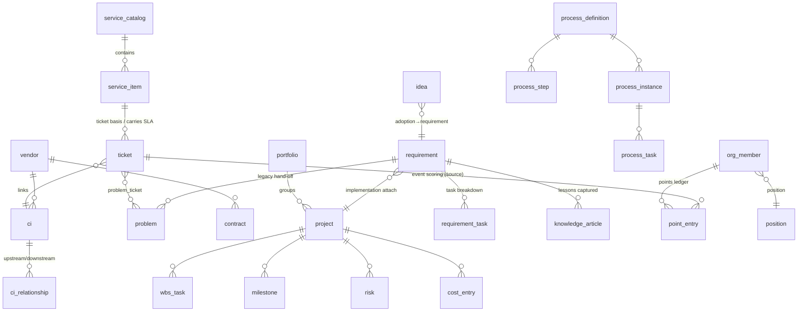

# ITOM Data Model Design

> English translation of [../04-数据模型设计.md](../04-数据模型设计.md). For the authoritative version, the Chinese source prevails.

> Based on [03-PRD.md](03-PRD.md) (v1.0 finalized). **49 tables** in total: Support 15 (including 3 role/user-group tables + 3 department/business-domain/provisioning-rule tables, added in M2.5/M3.5), ITSM 12, Project 6, Requirement 2, Process 4, Team 10.
> Compared with SN-AOM's 106 tables; no pre-computed/snapshot tables at all.

## 0. Global Conventions

- Primary key: `id CHAR(26)` GLID, system-generated; not listed per-table below.
- Every table has `created_at` / `updated_at` (maintained automatically by the service layer); business-record tables have an `is_deleted BOOLEAN DEFAULT FALSE` soft-delete flag; not listed per-table below.
- Personnel references: uniformly store `org_member.id` (foreign key), displaying the name on the page.
- Business codes (`*_code`): `prefix-YYYYMM-sequence`, generated on creation, with a unique index.
- Fields marked **[C]** (computed) are system-computed/stamp-maintained with no input endpoint; tables marked **[cfg]** are maintained by admin only.

---

## 1. Support Domain (9 tables)

### 1.1 auth_user — login account

| Field | Type | Description |
| --- | --- | --- |
| username | VARCHAR(64) UNIQUE | Login name |
| password_hash | VARCHAR(255) | bcrypt |
| person_id | FK→org_member | Links to personnel master data (requester may have none) |
| roles | JSONB | Array of roles, e.g. `["it_dev","manager"]` (one person, many roles) |
| is_active | BOOLEAN | |
| last_login_at | TIMESTAMP | [C] |

### 1.0 department / business_domain / provision_rule (added in M3.5)

- **department**: code UNIQUE, name, parent_id self-reference, dept_type (it/business/audit), external_source/external_id (reserved for Feishu/AD sync), sort, active. One person, one department; pure data.
- **business_domain**: code UNIQUE, name, description, owner_id FK org_member (the BP owner, a field not a role), backup_owner_id, sort, active.
- **provision_rule**: match_type (dept_type/department), match_value, default_roles JSONB, sort (lower matches first and stops), active. Takes effect only on first account provisioning.
- **org_member changes**: drop the dept/team text columns (migrated to the department table / user groups); add name_en, department_id FK, mobile, external_source, external_id.
- **auth_user changes**: add auth_source (local/ad/feishu/sms/wechat), external_id.
- **user_group changes**: add roles JSONB (group-granted roles; a person joining the group inherits them automatically).

### 1.1a role — role registry [cfg] (added 2026-07-10)

code UNIQUE, name, description, base_role (the built-in role code that a custom role inherits; empty for built-ins), is_builtin. The 9 built-in roles are seeded and read-only; custom roles inherit API permissions via base_role and can be referenced by workflow_transition.allowed_roles and process_step.default_role.

### 1.1b user_group / user_group_member — user groups (added 2026-07-10)

user_group: code UNIQUE, name, description. user_group_member: group_id + person_id UNIQUE composite. The authorization/assignment reference key is `group:<group-code>`.

### 1.2 org_member — personnel master data

| Field | Type | Description |
| --- | --- | --- |
| name | VARCHAR(64) | Required |
| dept | VARCHAR(64) | Department |
| team | VARCHAR(64) | Team grouping |
| position_id | FK→position | Position |
| status | VARCHAR(16) | Active / Departed |
| hire_date | DATE | |
| email | VARCHAR(128) | |
| feishu_user_id | VARCHAR(64) | Reserved, for Feishu integration |
| skills | JSONB | Array of skill tags |
| remarks | TEXT | |

### 1.3 workflow_status — status definitions [cfg]

entity_type (ticket/problem/requirement/project/wbs_task/idea/hiring_need), code, name, is_initial, is_terminal, sort.

### 1.4 workflow_transition — status transitions [cfg]

entity_type, from_code, to_code, allowed_roles JSONB. The backend validates before every status change.

### 1.5 master_data — data dictionary [cfg]

category (business line / closure code / requirement source / CI category extension-attribute definitions …), code, name, sort, active. The source of all dropdown items.

### 1.6 audit_log — audit log (append-only)

entity_type, entity_id, action, actor, summary JSONB (before/after values of changed fields), created_at.

### 1.7 notification_outbox — notification outbox

event_type, entity_type, entity_id, payload JSONB, channel (in_app/feishu…), status (pending/sent/failed), sent_at. **The future hook for Feishu/n8n.**

### 1.8 in_app_notification — in-app notification

recipient FK→org_member, title, content, link (front-end route), read_at. The data source for the top-bar bell.

### 1.9 attachment — generic attachment

entity_type, entity_id, filename, storage_path, size, uploaded_by. Shared by contract attachments, project documents, and original charter files.

---

## 2. ITSM Domain (12 tables)

### 2.1 service_catalog — service catalog [cfg]

code, name, tier (gold/silver/bronze), description, sort, status.

### 2.2 service_item — service item [cfg]

| Field | Type | Description |
| --- | --- | --- |
| item_code | UNIQUE | Automatic |
| name | VARCHAR(128) | Required |
| catalog_id | FK→service_catalog | Required |
| service_type | VARCHAR(32) | Dictionary |
| owner | FK→org_member | |
| description | TEXT | |
| sla_response_hours / sla_resolution_hours | FLOAT | Overrides the SLA policy default; nullable |
| target_audience | VARCHAR(128) | |
| status | VARCHAR(16) | Listed / Delisted |

### 2.3 ticket — ticket (single table, multiple types; 38 columns, only 5 required on creation)

| Group | Fields | Description |
| --- | --- | --- |
| Required on creation | title, ticket_type (incident/service_request/change), priority (P1-P4), description, service_item_id FK | |
| Optional on creation | assignee FK, ci_id FK, remarks | |
| Change conditional fields | change_type, risk_level, change_reason, rollback_plan, planned_start_at, planned_end_at, implementation_plan | change type only |
| Staged fields | solution, root_cause, closure_code, satisfaction (1-5) | at resolution/closure/follow-up |
| Approval [C] | approved_by, approved_at, approval_comment | written by change approval |
| Derived [C] | ticket_code, status, submitter, submitter_dept, service_line, submitted_at, first_response_at, resolved_at, closed_at, paused_minutes (on-hold accumulation, deducted from SLA), reopen_count, first_time_fix, sla_response_min, sla_resolution_hours, sla_response_met, sla_resolution_met | |
| Links | problem_id FK→problem (back-written after escalation), requirement_id FK→requirement, process_instance_id | |

Indexes: status, assignee, service_item_id, submitted_at, (ticket_type, status).

### 2.4 problem — problem

problem_code [C], title, description, priority, status [C], service_item_id FK optional, root_cause (staged), workaround (staged), source_ticket_id FK, source_requirement_id FK (written when a legacy requirement problem is handed off).

### 2.5 problem_ticket — problem-ticket link

problem_id + ticket_id, UNIQUE composite. Supports "multiple tickets with the same root cause attached."

### 2.6 ci — configuration item (merges the original 9 tables)

| Field | Type | Description |
| --- | --- | --- |
| ci_code | UNIQUE | Automatic |
| name | VARCHAR(128) | Required |
| category | VARCHAR(32) | Required, 9 categories (dictionary) |
| status | VARCHAR(16) | Required, default "Running" |
| owner | FK→org_member | Required |
| environment | VARCHAR(16) | Production / Test / Development |
| business_owner | VARCHAR(64) | |
| vendor_id | FK→vendor | |
| description / launch_date / remarks | | |
| attrs | JSONB | Category-specific attributes (attribute names defined by master_data per category) |

### 2.7 ci_relationship

source_ci_id, target_ci_id, relation_type (runs-on / depends-on / connects-to), UNIQUE(source, target, type).

### 2.8 sla_policy — SLA policy [cfg]

priority (P1-P4, UNIQUE), response_minutes, resolution_hours, active. Service-item fields can override.

### 2.9 vendor — vendor

code [C], name, contact, phone, email, service_scope, rating, status, remarks.

### 2.10 contract — contract

code [C], name, vendor_id FK, amount_10k, start_date, end_date, owner FK, status [C] (Active / Expiring / Expired, derived from dates), remarks. Attachments go through attachment.

### 2.11 knowledge_article — knowledge article

article_code [C], title, content (Markdown), tags JSONB, status (Draft / Published), author [C], view_count [C], helpful_count [C], linked_ticket_ids JSONB, source_requirement_id FK (written when requirement lessons are handed off).

### 2.12 knowledge_vote — knowledge vote (duplicate-proof)

article_id + person, UNIQUE composite. Triggers the "marked helpful" points.

---

## 3. Project Domain (6 tables)

### 3.1 portfolio — portfolio

code [C], name, owner FK, year, description, status.

### 3.2 project — project

| Group | Fields |
| --- | --- |
| Required on creation | name, pm FK, planned_start, planned_end |
| Optional on creation | portfolio_id FK, description, budget_10k, service_item_id FK |
| Staged | latest_update (one-line update) |
| Derived [C] | project_code, status, actual_start, actual_end, progress_pct (WBS-weighted), health_status (green/yellow/red, per PRD 6.1 rules), actual_cost_10k (rolled up from cost_entry) |

> progress_pct / health_status / actual_cost_10k are **redundant computed columns**: on task/cost/milestone changes, the service layer recomputes and writes them back synchronously (to guarantee list-filtering performance); they are not user-maintained.

### 3.3 wbs_task — WBS task

project_id FK, parent_task_id FK self-reference, wbs_code [C] (generated from tree position), task_name, assignee FK, start_date, end_date, status, description, deliverable, predecessors JSONB (array of task ids), progress_pct [C] (status-mapped 0/50/100), sort.

### 3.4 milestone — milestone

project_id FK, name, target_date, actual_date, description, status [C] (Pending / Achieved / Overdue).

### 3.5 risk — risk

project_id FK, title, probability (High/Medium/Low), impact (High/Medium/Low), response_plan, owner FK, status (Open / Mitigated / Closed).

### 3.6 cost_entry — cost detail

project_id FK, wbs_task_id FK nullable, date, amount_10k, description, created_by [C].

---

## 4. Requirement Domain (2 tables)

### 4.1 requirement — requirement

| Group | Fields |
| --- | --- |
| Required at registration | name, req_type (business/functional/data/integration/compliance), business_line (dictionary), description |
| Optional at registration | source (dictionary), parent_requirement_id FK, service_item_id FK, doc_link, remarks |
| Analysis stage | priority (MoSCoW), owner FK, target_date, solution, acceptance_criteria JSONB `[{text, checked, verified_by}]` |
| Implementation stage | project_id FK (optional attachment) |
| Derived [C] | requirement_code, stage (Registration/Analysis/Implementation/Closure/On-Hold/Cancelled), requester, submitted_at, analysis_at, implement_at, closed_at, progress_pct (task roll-up), lead_time_days (delivery lead time) |

### 4.2 requirement_task — requirement task

requirement_id FK, name, assignee FK, planned_date, status (Not Started / In Progress / Done), completed_at [C].

> No separate table is needed for closure hand-off: `problem.source_requirement_id` and `knowledge_article.source_requirement_id` are queryable both ways.

---

## 5. Process Domain (4 tables)

### 5.1 process_definition — process definition [cfg]

code, name, entity_type (linked record type), trigger_condition JSONB (e.g. `{"ticket_type":"change"}`), version, active, description. Initially seeds 6–8 rows.

### 5.2 process_step — process step [cfg]

definition_id FK, seq, name, default_role (it_bp/it_pdm/it_pm/it_dev/it_ops/is_mgr/manager), autonomy_level (L1-L4), sla_hours, description.

### 5.3 process_instance — process instance

definition_id FK, entity_type, entity_id (triggering record), status (In Progress / Completed / Terminated), current_step_seq [C], started_at, completed_at.

### 5.4 process_task — process task

instance_id FK, step_id FK, assignee FK (resolved from default role, reassignable), status (Pending / In Progress / Done / Skipped), started_at, due_at [C] (from the step SLA), completed_at, comment.

---

## 6. Team Domain (10 tables)

### 6.1 position — position definition

name, duties TEXT (division of duties), headcount INT (headcount number). Gap = headcount − active members [C].

### 6.2 hiring_need — hiring need

position_id FK, count, status (To Recruit / Interviewing / Onboarded / Cancelled), progress_note, closed_at.

### 6.3 development_activity — training activity

code [C], activity_type (internal cross-training / external technical exchange / new-technology research), topic, date, presenter FK, organizer FK, participants JSONB (array of org_member ids), output_link, created_by [C]. Registration triggers a point event.

### 6.4 team_charter — team culture

section (vision/goals/code_of_conduct, UNIQUE), content (rich text), updated_by [C].

### 6.5 idea — suggestion

idea_code [C], title, description, submitter [C], status (Submitted / Adopted / Implemented / Declined), like_count [C], adopted_by, adopted_at [C], linked_requirement_id FK (written when an adoption is converted to a requirement).

### 6.6 idea_like — suggestion like

idea_id + person, UNIQUE composite.

### 6.7 point_rule — point rule [cfg]

rule_code, name, event_type (UNIQUE, see the event list in doc 05), points INT (may be negative), active, description.

### 6.8 point_entry — points ledger (append-only)

person FK, event_type, points, rule_id FK, source_entity_type, source_entity_id, earned_at, remark, created_by (records the operator on a manual point adjustment and requires a remark). Indexes: (person, earned_at), event_type. The leaderboard / personal detail / monthly trends are all aggregated live from this.

### 6.9 performance_rule — performance rule [cfg]

name, dimension, source_config JSONB (data source and formula, defined by product later), weight, period_type (month/quarter), active.

### 6.10 performance_score — performance-score result

person FK, period (e.g. 2026-07), dimension, score, detail JSONB (traceable computation details), computed_at. **Can be recomputed and overwritten anytime per the rules** (a result snapshot, not manual data; historical periods are retained for export).

---

## 7. Core Relationship Diagram

## 8. Reconciliation Against the Design Principles

| Principle | How it is realized |
| --- | --- |
| No pre-computed tables | Not one of the 43 tables is a statistics/snapshot table; project's three computed columns and performance_score are "system-maintained computation results," not manual data |
| Minimal entry | Each table's "required on creation" group has ≤ 5 fields |
| Event-driven | notification_outbox + point_entry are written by the same domain-event outlet |
| Duplicate-proof | idea_like / knowledge_vote unique constraints |
| Feishu reserved | org_member.feishu_user_id, outbox.channel |
